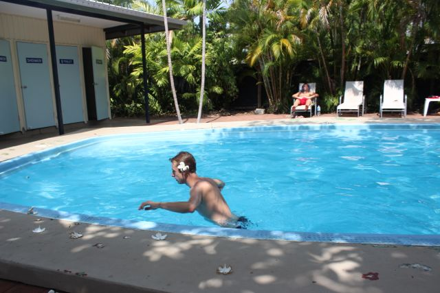
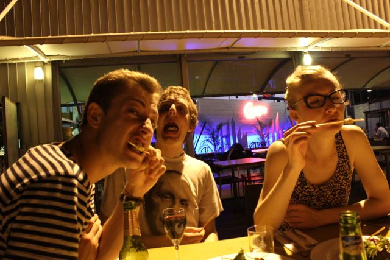

[Navigation]()

After a couple of hours flight, covering a distance that is approximately the
distance from Copenhagen to Sevilla, we arrived in Darwin. It was a sunny and
warm day, Orion, our Frenchmen in the team immediately started complaining
about the heat as we all were not prepared for the weather change. A few hours
earlier we were freezing in Adelaide's spring rain. Still at the airport we met
a group of other exchange students that were spending their time in Darwin for
the Mid-semester break. We had chat with them and shared the shuttle bus to the
city center to get to our hostel (Dingo Moon Lodge).

When we arrived at the hostel the girls went to do some basic grocery shopping
to make lunch for tomorrow (Sunday) while we took a bath in the hostel's pool.
As it got darker we got ready to get out in the city. Orion was eager to taste
some crocodile meat, a specialty in Darwin and other cities that are close to
crocodile areas. We found a restaurant directly at the sea front that offered
crocodile so we sat down and enjoyed the finale of our first day.

Next: [Darwin - Mindil Beach]()
