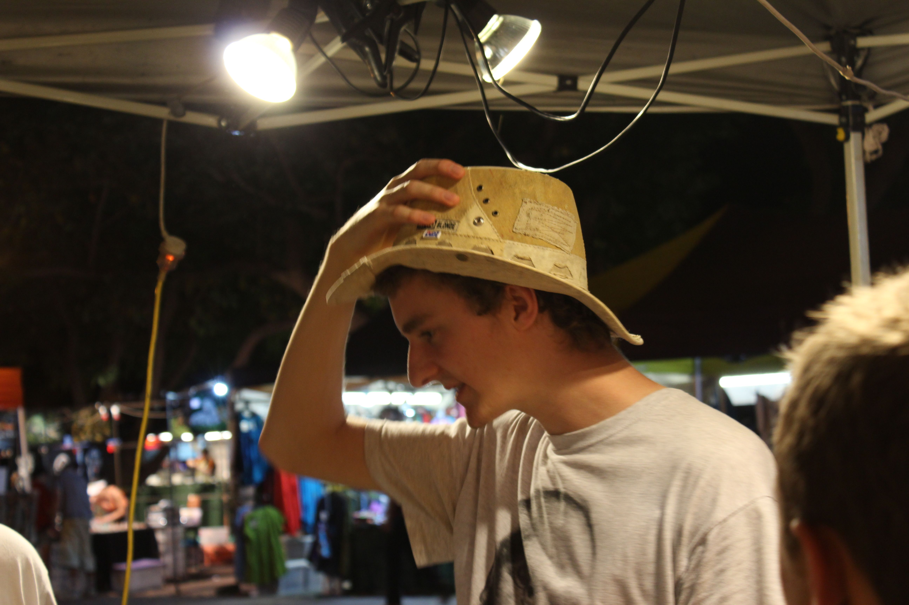
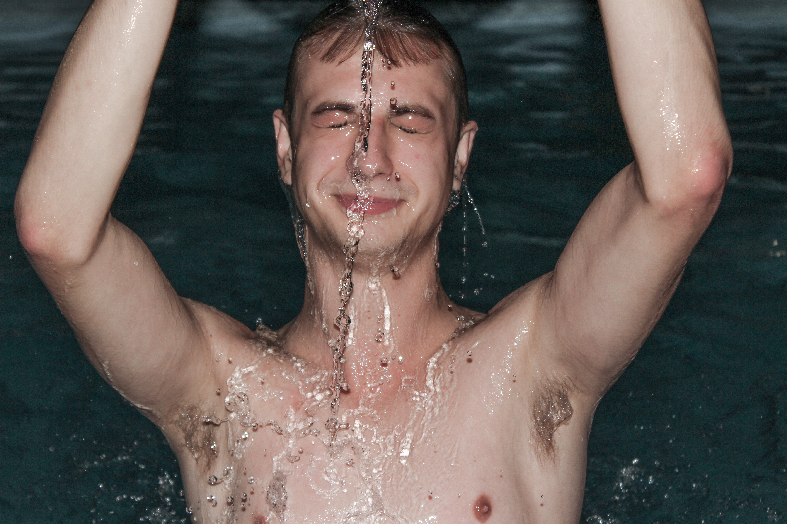

[Navigation](/posts/30-der-stuart-highway/)

Vorher: [Darwin - Krokodilfleisch](../day_01)

Die erste Nacht außerhalb von Adelaide. Wir alle wachten munter und bereit für
das Abenteuer das uns bevor steht auf. Der Tag war ohne spezielle Ereignisse
und wir gingen nur ins Wellenbad, da es zu gefährlich ist im Ozean schwimmen
zu gehen (Haie, Krokodile etc.) und haben den Rest des Tages am Hostel Pool
verbracht. Am Abend gingen wir zu einem Strandmarkt ein paar Minuten außerhalb
von Darwin. Es war eine gute Gelegenheit ein paar Souvenirs zu bekommen(Ich hab
mir nichts gekauft). Jamie, unser Junge aus Newcastle, hat sich einen Hut aus
alter Road Train(LKW)Plane gekauft.

In zukünftigen Bildern wird er öfter mal mit dem Hut auftauchen. Wir haben noch
ein paar Stunden auf dem Markt verbracht und der Livemusik zugehört. Hinterher
gingen Jamie, Orion und ich an den Strand und Lin und Maddy gingen nach Hause.
Der Strand war übersät mit kleinen Einsiedlerkrebsen, die vor uns weg liefen
als wir Richtung Stadtzentrum marschierten. Es wirkte ein bisschen als ob der
ganze Strand in Bewegung wäre. Zurück im Hostel haben wir noch ein bisschen
Zeit damit tot geschlagen Bilder am Pool zu machen.

Als nächstes: [Nach Litchfield - Das Wicked Erlebnis](../day_03)
