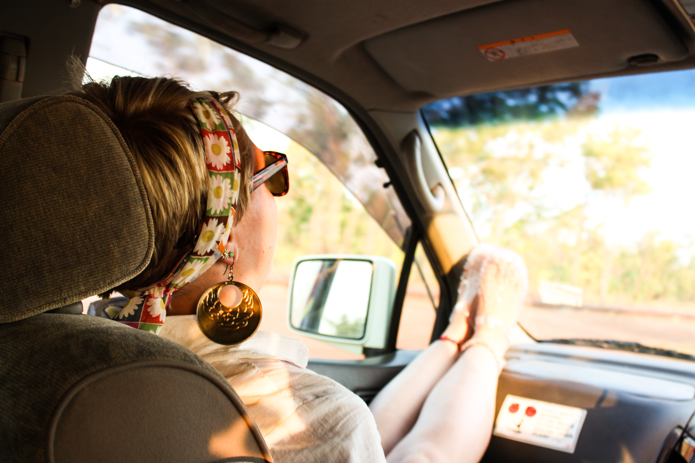
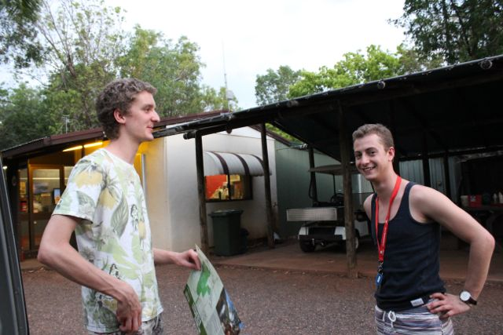

[Navigation](/posts/30-der-stuart-highway/)

Previous: [Darwin - Mindil Beach](../day_02)

During our planing before the trip it took a really long time to find a camper
that suits our needs. The biggest constrain was budget since we all are
students and look for a cheap way to experience Australia. However, since I was
the only one older than 21 and had a driver's license in the group we also
needed a company that allowed young drivers. The second constrain was actually
the most limiting. We found a great amount of budget companies that rent out
vans for an acceptable price. However, only one allowed drivers younger than
21: Wicked.

Wicked is an interesting company. Every citizen of Australia heard at one point
about this company. It is well known for their sloppy maintenance and Wicked
cars tend to be more involved in accidents than other rental companies. That
includes broken tires, engine, etc. However, it is not clear if that is just
due to the young clientele or faulty maintenance.

The facts about Wicked are they are cheap, they only provide the minimal you
need, they provide empty tanks and accept empty tanks, they accept young
drivers, check your car thoroughly before you leave. In our case we got 5
plates, bowls and sets of cutlery, the 12V cigarette plug had a broken fuse,
the front left of the car had a dent. The 12V was quickly fixed after we told
them about it. However, the most disappointing about the company is not the
quality of their rentals, everyone knows that they are shit but it's okay
because they are cheap, it is the service. We booked a camper that can sleep 5
people and got one that only sleeps 3. Now, how do you get 5 people through the
outback if you only have 3 spots at night? We had to buy a 2 person tent. After
2.5 hours of negotiation between Jamie & Maddy and the nice lady behind the
counter, we finally got compensation for the tent as well as discounts on the
car. A deal that we all were able to live with.

The whole negotiation cost us a lot of time. We initially planned on leaving
Darwin around 12 and get to the Adelaide River to take a tour to see Saltwater
Crocodiles. It turned 2 when we finally had all Wicked related stuff behind us
(Orion and I went back to solve the 12V issue while the others got supplies for
the trip). That made it impossible to still have the tour on the Adelaide
River. Finally, we left Darwin around 5, just an hour before sunset. Sunset was
always our aim to finish a day trip, after sunset wallabies, kangaroos and
other animals tend to be more active, walk around on the streets and are harder
to see. Additionally, the van was not insured after sunset. We arrived on the
campsite close to Litchfield National Park just minutes before it good pitch
black. A very hectic and long day finally ended. We were rewarded with a clear
night sky.

Next: [In Litchfield – Of Waterfalls and basking](../day_04)
