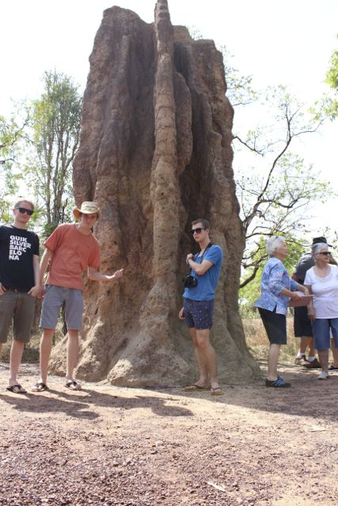
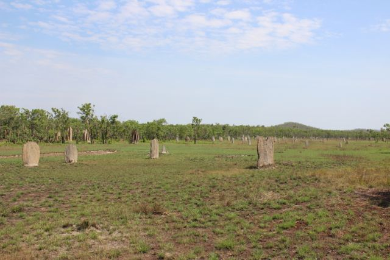
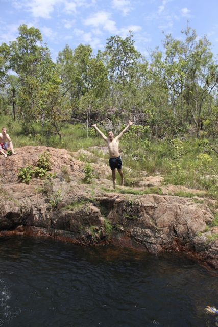
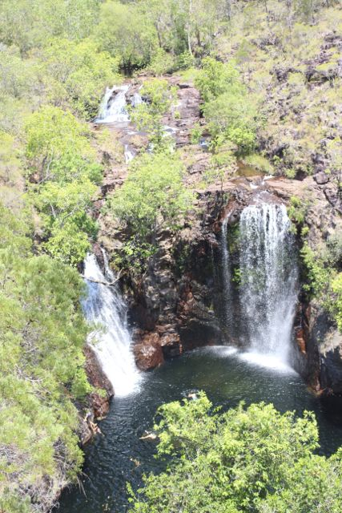
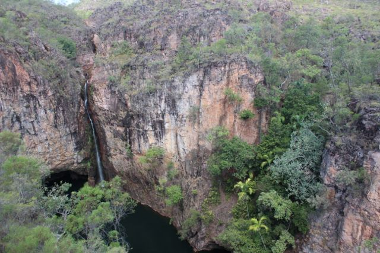
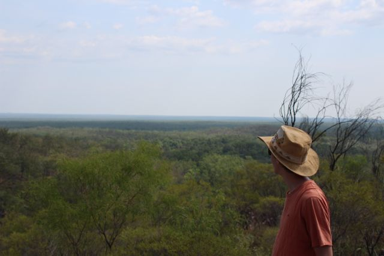
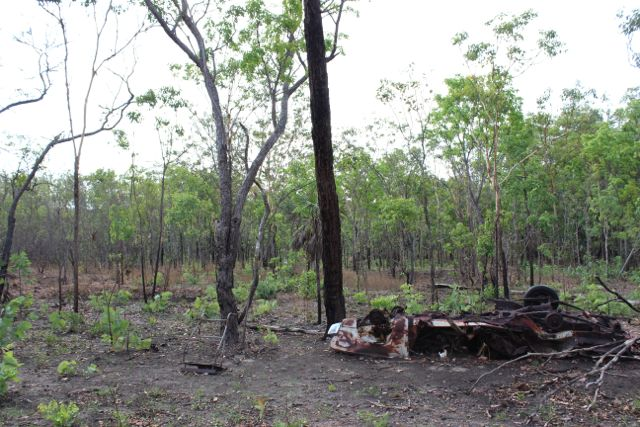
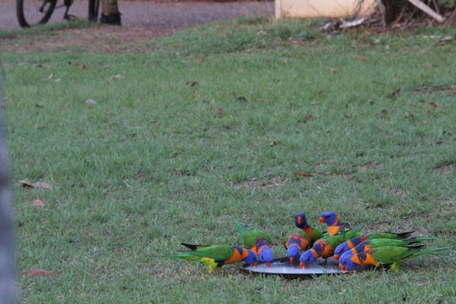

[Navigation](/posts/30-der-stuart-highway/)

Vorherige: [Nach Litchfield - Das Wicked Erlebnis](../day_03)

Die erste Nacht campen war überraschend einfach. Wir hatten unsere Probleme die
Betten im Van für uns drei fertig zu machen aber das wurde gen Ende des Trips
immer einfacher und gemütlicher. Wir alle wachten mehr oder weniger pünktlich
auf. Einige von uns hatten Schwierigkeiten die vereinbarte Zeit vom Vorabend
ein zu halten, und wie ich so bin wurde ich nervös als wir nicht unseren
Zeitplan einhielten. Wie auch immer, als sie alle ihren Caffe ausgetrunken
hatten fuhren wir nur mit einer geringen Verspätung los. Das meiste unserer
Sachen verstauten wir im Zelt der Frauen, da wir für die nächste Nacht wieder
auf den Zeltplatz zurück kamen.

Der Park war einfach beeindruckend, wir hatten uns aus verschiedenen Gründen
entschlossen nach Litchfield zu kommen an Stelle vom Kakadu Nationalpark.
Obwohl der Kakadu Nationalpark der bekanntere der beiden ist und sehr
beeindruckende Höhlenmalereien der Aborigines haben soll entschieden wir uns
für den kleineren der beiden Parks. Der original Plan war, dass wir nach Kakadu
fahren aber einige Leute aus Darwin empfiehlen uns den kleineren Park, da sie
selber gerne fürs Wochenende nach Litchfield fahren. Außerdem wirkte kakadu für
unsere begrenzte Zeit einfach zu gigantisch. Die Eintrittskarte ist für 2
Wochen gültig und gibt damit schon einen sehr guten Eindruck wie viel Zeit man
mitbringen muss, um einen vernünftigen Einblick in den Park zu bekommen. Im
Kontrast dazu ist Litchfield nur ein Bruchteil der Größe und wir haben es
geschafft den meisten erreichbaren Teil des Parks zu sehen und der Eintritt war
frei(YIIHAAAA).

Der erste Stop im Park waren die Magnetic Termites. Wir machten im Auto Witze
darüber warum sie wohl so hießen (magnetic: eng. magnetisch). Vielleicht hießen
sie ja so weil sie Leute magnetisch anziehen und uns dann bei lebendigen Leibe
verschlingen. Ne, sicherlich nicht. Wir werden's schon noch raus finden. Als
erstes sahen wir zwei gigantische Termitenhügel direkt am Parkplatz, die ca. 4
Meter hoch waren. Ziemlich beeindruckend, wenn man sich bewusst wird, dass
Termiten winzige Insekten sind, die auf dem Boden herum krabbeln. Wir stellten
sicher, dass wir erstmal ein paar gute Aufnahmen von den Hügeln bekamen bevor
wir uns weiter zu den Magnetic Termites machten. Wir hatten das Glück, dass
eine Gruppe von Senioren gerade eine Tour machten und einen Reiseführer dabei
hatten, der alles genauestens erklärte. Die Termiten in den riesigen Bauten am
Parkplatz verließen den Bau schon vor einigen Jahren(ich glaube sie sagte etwas
von einem Jahrzehnt). Außerdem lüftete der Führer, dass die Magnetic Termites
ihren Namen von den Hügeln hatten, die von Norden nach Süden ausgerichtet sind,
perfekt in Linie mit dem Magnetfeld der Erde, um der heißen Mittagssonne zu
trotzen. Das Feld auf dem die Termiten ihre Hügel hatten wirkte etwas wie ein
Friedhof, da die Hügel ähnlich wie Grabsteine angeordnet waren.

Zu dem Zeitpunkt fühlten wir alle wie uns die Hitze zu viel wurde und es war
nicht mal der heißeste Punkt des Tages. Wir wollten einfach nur in einen kalten
Pool, um uns ein wenig ab zu kühlen. Glücklicherweise stellte sich heraus, dass
die meisten Sehenswürdigkeiten im Park Wasserfälle waren. Der nächste Stop war
das Buley Rockhole. Wir wanderten den Pfad vom Parkplatz und sobald wir das
Wasser sahen war Jamie auch schon verschwunden. Wir zogen schnell T-Shirt und
Schuhe aus und sprangen ins Wasser. Das Wetter war sonnig und heiß, das Wasser
hatte die perfekte Temperatur und lief über mehrere Hundert Meter Fels bevor es
im Wald verschwand. Der Fels hatte mehrere kleine Becken gebildet, die nur dazu
einluden zu schwimmen, ins Wasser zu springen und einfach zu relaxen. Wir
verbrachten einige Stunden dort bevor wir uns entschieden mal den Rest des
Parks zu erkunden.

Das Buley Rockhole, nachdem es sich durch den Wald geschlängelt hatte, wurde zu
einem beeindruckenden Wasserfall. Der atemberaubendste, den ich je gesehen
habe. Ich hab noch nicht viele gesehen aber das war einfach reine Schönheit und
eine neue Gelegenheit schwimmen zu gehen. Wir planschten noch ein bisschen und
verbrachten etwas Zeit am Wasserfall.

Wir führen zum nächsten Wasserfall, der sich als nicht schwimmbar
herausstellte. Es war etwas ernüchternd, da wir alle in Badelaune waren, aber
die Aussicht auf den Wasserfall und die Umgebung war ein guter Ausgleich.

Ein Blick auf die Uhr verriet uns, dass es Zeit war sich ein wenig zu beeilen,
da der Sonnenuntergang nur ein paar Stunden entfernt war, wovon alleine eine
Stunde die Autofahrt war. Da wir nun die meiste Zeit damit verbracht hatten
Wasserfälle zu bestaunen entschieden wir uns den Rest zu überspringen und uns
ein bisschen Kultur an zu tun. Im Norden des Parks war eine alte Zinnmine, die
wir uns anschauen wollten. Wir erwarteten ein großes Abbaugebiet und waren
etwas erschrocken, als wir feststellten, dass wir dran vorbei gefahren sind,
ohne es zu bemerken. Wir drehten das Auto um und fanden eine kleine
Schotterstraße, die in den Busch führte. Die Frauen hatten ihre Bedenken, da
wir nur auf befestigten Straßen versichert waren. Die Straßenkarte versprach
nur eine relativ kurze Strecke auf dem Schotter zur Mine und die Verhältnisse
der Straße wirkten gut genug für unseren Van. Es stellte sich heraus, dass es
wirklich nicht so schlimm war und wir erreichten den Parkplatz schon nach
wenigen hundert Metern. Die Mine selber war echt ernüchternd und nicht mehr
als eine alte Hütte mit einem Loch im Berg. Als die Mine noch aktiv war
sammelten nur eine Hand voll Arbeiter das Zinn vom Boden auf, da es in großen
Platten auf der Oberfläche abbaubar war. Sie brachen es in Stücke und
verkauften es wie es war.

Der letzte Stop des Tages war abgehakt, Orion setzte sich hinters Steuer und
führ uns sicher wieder zurück zum Campingplatz. Es war schon ein gutes Stück zu
fahren, dass man auf der hinfahrt nicht merkte, da wir sonst nur 20 Minuten
zwischen den Stops hatten. Als wir den Van wieder mit Sprit voll machten
bekamen wir noch einen Benzinkanister gratis dazu, da die Frau hinterm Tresen
anscheinend nicht ganz wusste was sie tat. Wir merkten das allerdings erst
später beim Überprüfen der Kassenbelege und waren um so glücklicher.

Als Nächstes: [Mataranka - Planschen mit Krokodilen](../day_05)
