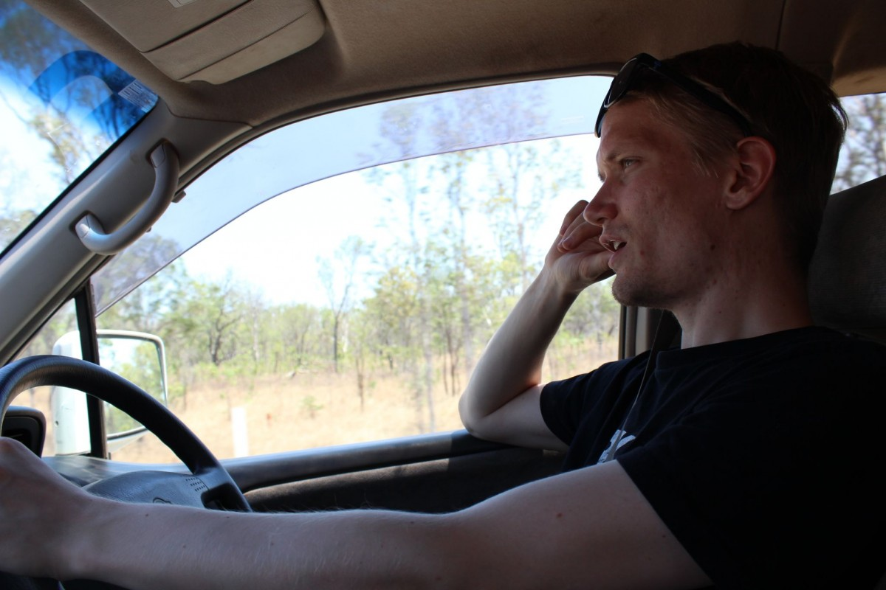
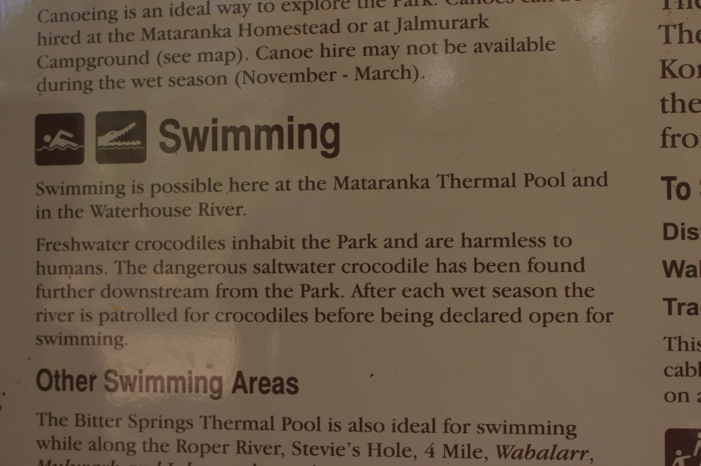
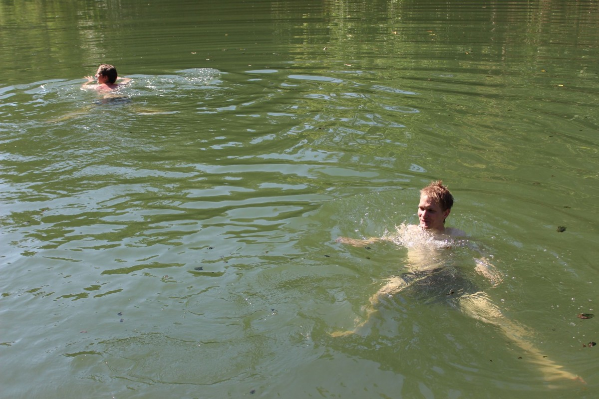
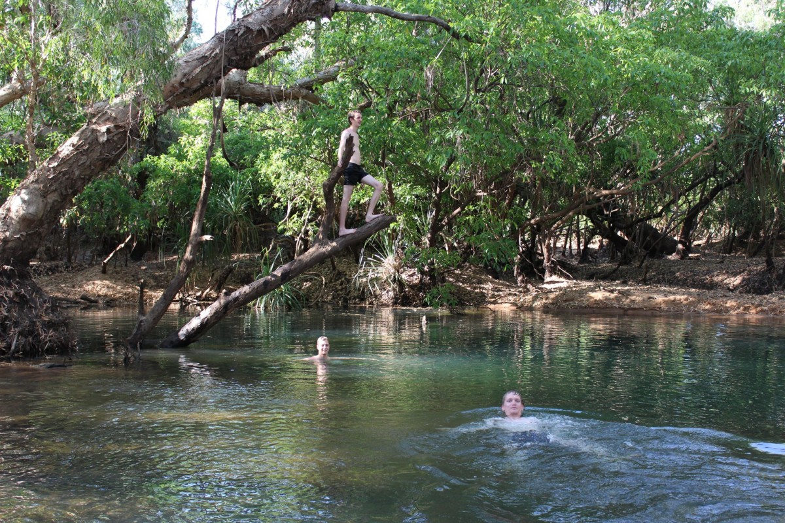

[Navigation]()

Previous:  [In Litchfield – Of Waterfalls and basking]()

The sun went up on one of our serious driving days. We had a long ride ahead
due to out tight schedule. University didn't sleep for us and we had to
be back in time for Lin to finish her essay that was due on the last friday of
our vacation. However, from our Campsite near Litchfield we had around 360km to
our next stop in Mataranka. The 4h drive was a good preparation of what was
still lying ahead of us. We only had 1 longer stop in Katherine to stock up
some of our groceries and tell the world where we were (No mobile reception
since Darwin).

When 5 people who never met before get together and decide to go on a vacation
for 2 weeks it is already predestined that it won't be as smooth as you
would wish. In Katherine we had an outbreak of some sort that was related to
that issue. During the shopping it became clear that some had a different
idea of how this trip should look like. I am not going into details here. The
fact is that we should have clarified in the beginning how things should be
divided, what we need for this vacation and what we expect from it. At this
point I will also try to make some suggestions and give advice on how to avoid
a clash. Don't go on a vacation with people you don't know if you
feel uncomfortable of leaving your comfort zone. It is really unpleasant for
the others and might not change anything for you. If you still decide to go on
an adventure then do try to be open for new things. Exploring and trying new
stuff is valuable, getting used to change makes you flexible and functional in
new situations. If there is one thing I learned from leaving Bremen behind in
2010 than it is that. As a postcard on a very good friend's desk says
"The best journeys are not always in straight lines" and I
couldn't find words to bring it more precisely down to the point. Another
advice is one that I learned for myself from talking to Jamie on this trip.
Being stubborn is not helping at all. Mind-blowing I know. But it is especially
important if you don't want to ruin a trip.

Enough of this now and back to the journey that happened in very straight
lines.  We decided from that point on to split everything up and do groceries
separately as that was the main issue. We hopped all onto the bus and went
south again until we finally arrived in Mataranka. Mataranka was known for its
hot spring and that was what we enjoyed that day. We guys got of the van, took
our shorts and towels and went to the spring while the gals stayed at the van.
The spring was awesome and probably the most relaxing swim I ever had. When I
was in the Philippines I went with Schirin to Hot Springs but those were really
quite hot and you felt exhausted and sleepy afterwards. This one was completely
different. It was the perfect temperature. However, since we only had one day
in the city we decided to go for a walk around to see some other things.

The next thing was the river that the hot springs poured in to. A sign told us
that it was "harmless" to swim in. After the rainy season there
might be some saltwater crocodiles in there but usually they keep it clean.
However, without much ado we went down to the water and took a swim. It was
weird. Although we knew that there shouldn't be any saltwater crocs it
was still somehow haunting us. After a while we also had enough of that and
went on. We found signs to a waterhole around 2km from the springs.
Stevie's hole it was called and the path to it was just dirt and dead
trees, while only a few meters to the side it was lush and green vegetation.
After 20 or 30 minutes we arrived at the waterhole and it felt a little bit
like paradise. For the first time we were completely alone, and no tourists
spoilt the experience. On this hole was the same warning as at the river (by
the way: no tourists neither). However, it felt more secure because you could
see the banks and all access to the water. We went around and checked
everything before we went bathing. It was awesome. We stayed there for a couple
more hours and enjoyed the nature.

On our way back to the van we stopped at the hot springs where we met the
girls, stayed there for a bit and then end the day. After dinner they went back
to the springs while I went to bed. I felt super exhausted but happy about
everything we so until that day.

Next:  [Devil’s Marbles – A day in the car to see the sunset]()
