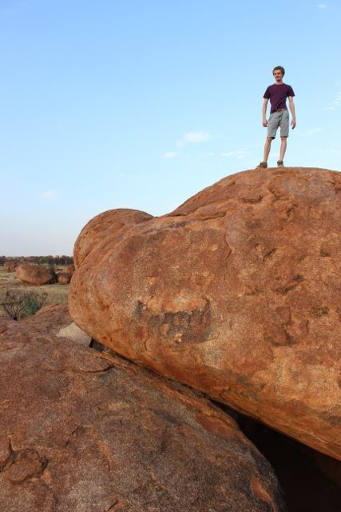
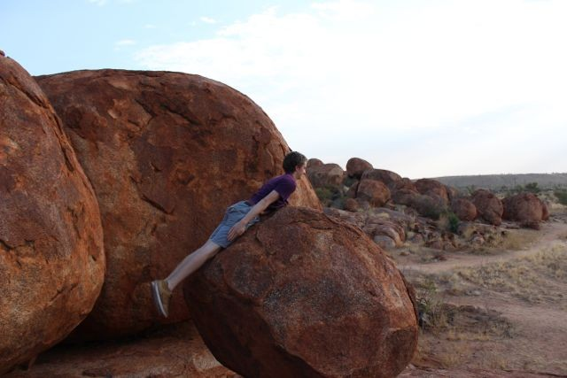
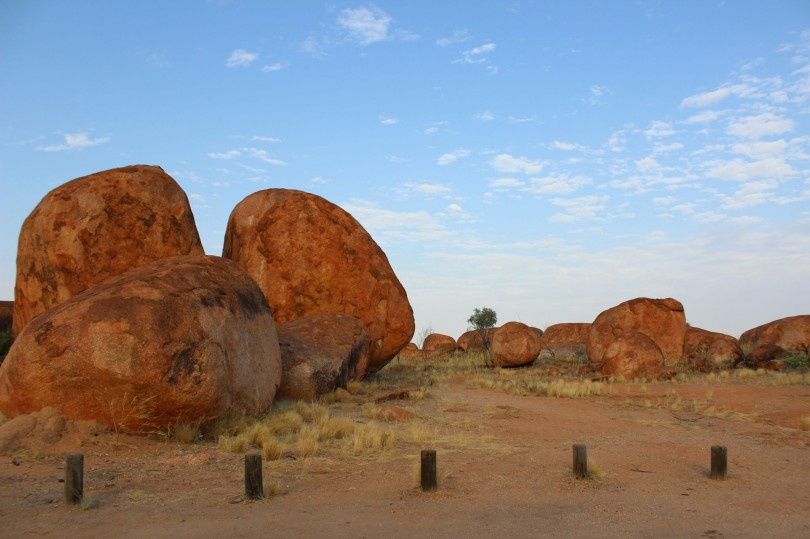
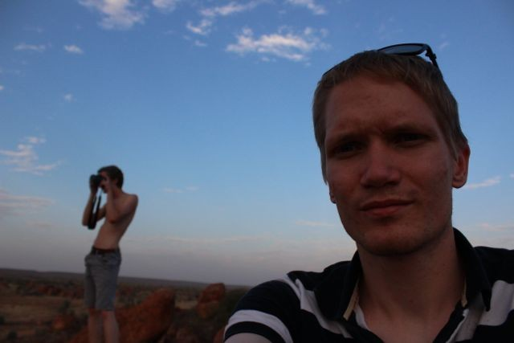
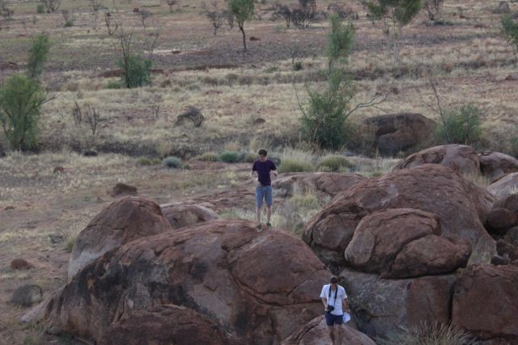
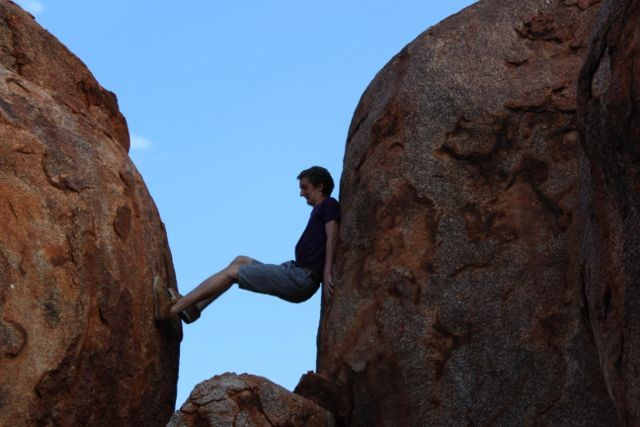

[Navigation]()

Previous: [Mataranka – Swimming with crocodiles]()

This was a very uninteresting day. We spent most of the time in the car. I was
sleeping most of the time and only woke up for the breaks. It took us until
dusk before we arrived at our destination: Devil's Marbles. It is a
location around 400km north of Alice Springs and a spectacular conservation
park. Hundreds of rocks that are almost perfectly shaped. That is where they
got their name from. Over a myriad of years wind, sand and rain weathered the
rocks.

After we watched the Sun set at the rocks we went to the campsite ~10min from
the rocks, made dinner, got a short refresh in the pool. While the others went
to have a drink with a guy that we met on the campsite I went to bed.

Next: [Alice Springs – Refreshing, getting back on track]()
