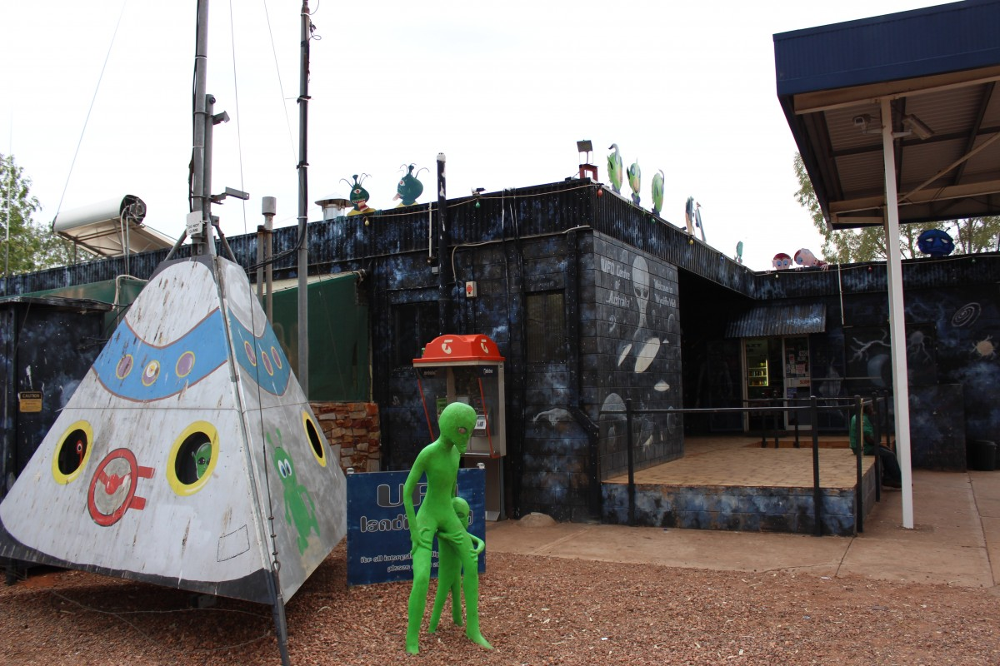
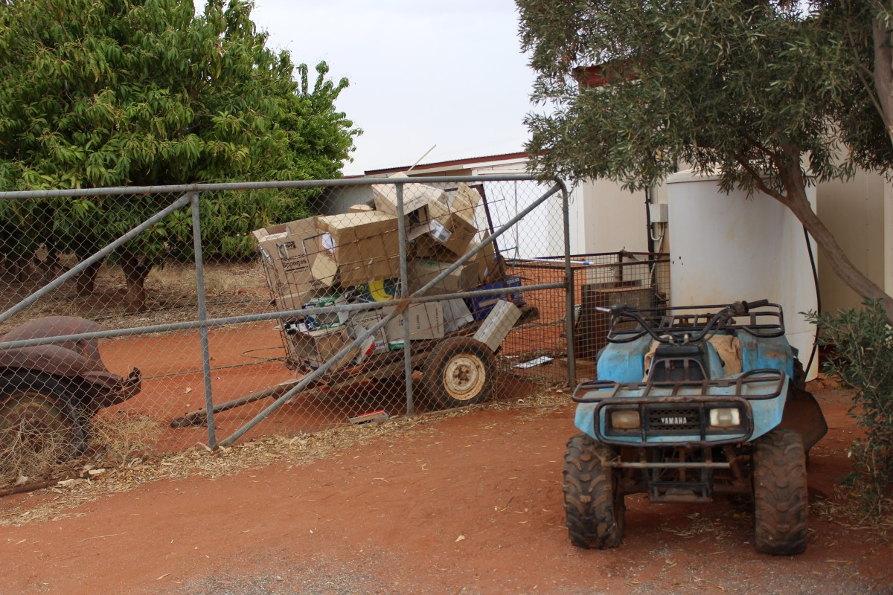
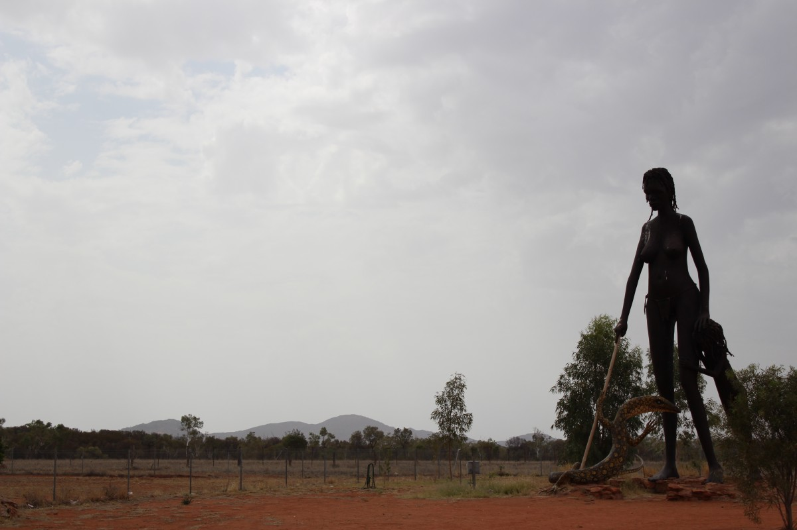

[Navigation]()

Previous: [Devil’s Marbles – A day in the car to see the sunset]()

Another very short and uninteresting day in terms of culture. We got up pretty
early at the campsite and started going south. Along the way we had 3 short
stops:

Stop 1: Wycliffe Well claims to be Australia's premier UFO spot. Whatever
that means. UFO's yeah sure.

Stop 2: We visited a Mango Farm. The guys got fresh mango ice cream, had a chat
with the girl behind the counter aaand we took off again. We still needed to
get to Alice Springs that day.

Stop 3: Aileron. A small community of artists live in Aileron and build 3
massive figures. We didn't stay long and all the buildings were closed.
But it was really quite something.

The next stop was Alice Springs. On the way we found out that hostels were
actually cheaper than campsites so we quickly looked up a hostel and pulled
into the drive way of what seemed like a suburban house. In the back were some
caravans which represented the rooms. It was really nice though. We got free
Wifi so I took a look at bing maps (Google and all related websites were
blocked due to too high traffic from Youtube the guy at the reception said) to
find out about the upcoming (exciting!!!!!!) stops. For the next two days we
were planning to go to King's Canyon and Uluru. After some discussion of
what we should do first and how to time everything to get the most out of it we
decided to go first to King's Canyon in the north, stay at the campsite
for the night, spend the next morning at the Canyon and take off to Uluru (aka.
Ayers Rock). The evening we would spent at Uluru, see the sunset on the rock,
wake up early in the morning and see the sunrise on the rock before we take off
to Coober Pedy. It sounds all very complicated but it was actually a very good
and solid plan.

Afterwards, the planning the next days for a bit we decided to separate for the
night. Lin and Maddy went ahead and we guys went to a restaurant to get some
food where we happened to meet other students from Adelaide University (Welcome
to the touristic sites of Australia!). Afterwards we met with a girls again,
had a drink and walked back home. Walking around Alice Springs at night can be
really scary and weird. The people living are pretty separated and you have the
touristic population on the one side and the aboriginal communities on the
others. We heard that it can get clashes between the two parties but we were
lucky to not get involved in anything. Instead, Orion, Jamie and I met a nice
Aborigine woman had a chat with her. I guess it really depends on how you
present yourself.

The next morning we packed the van and left Alice Springs towards King's Canyon.

Next: [King’s Canyon – A thunderstorm in the evening]()
