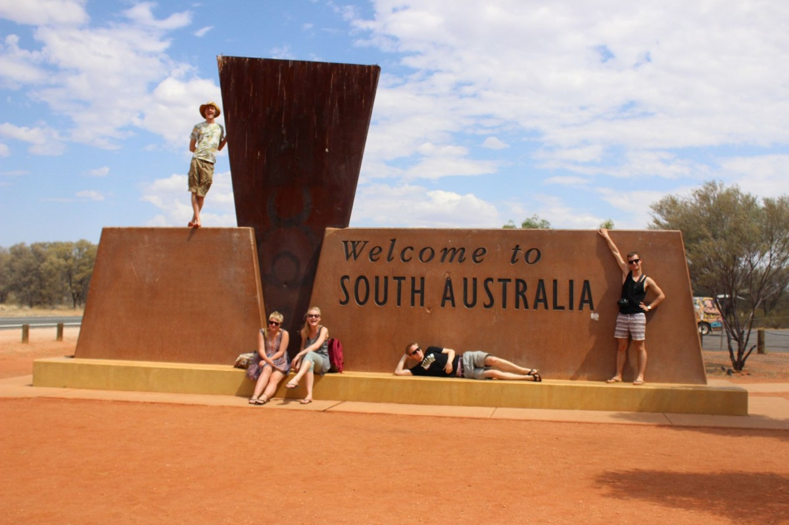
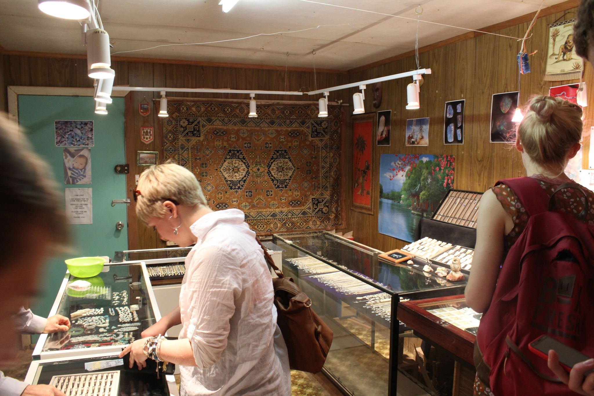
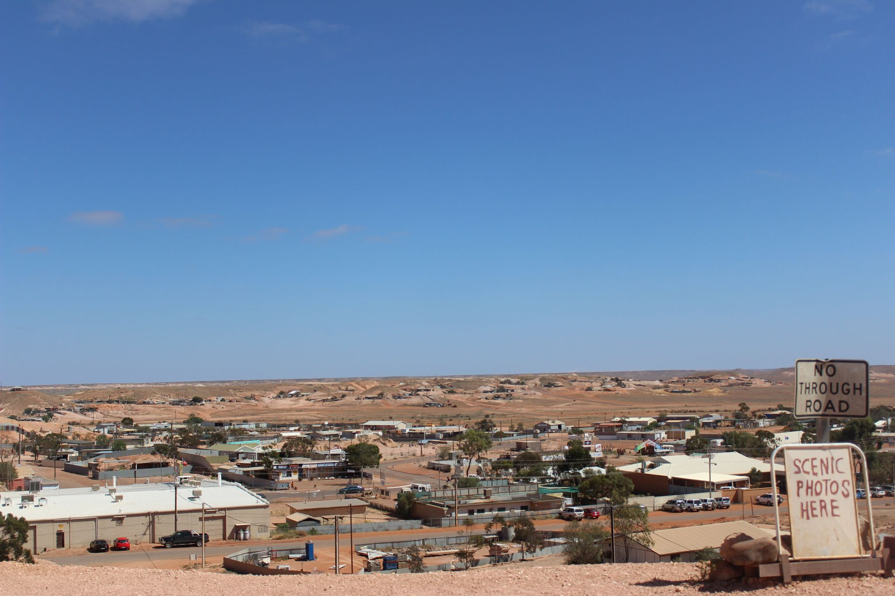
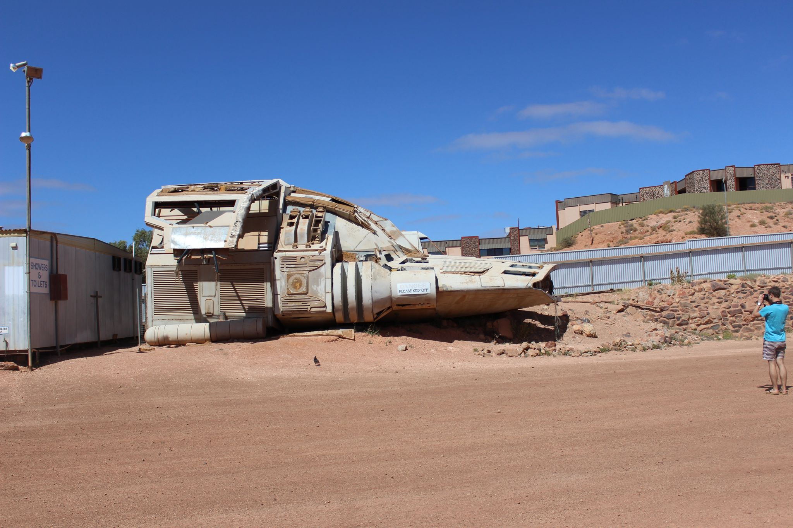
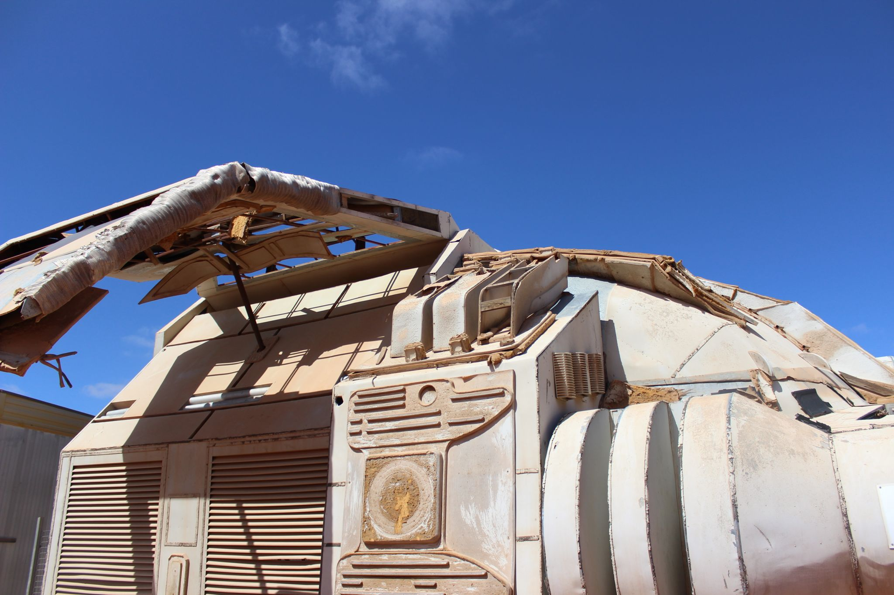
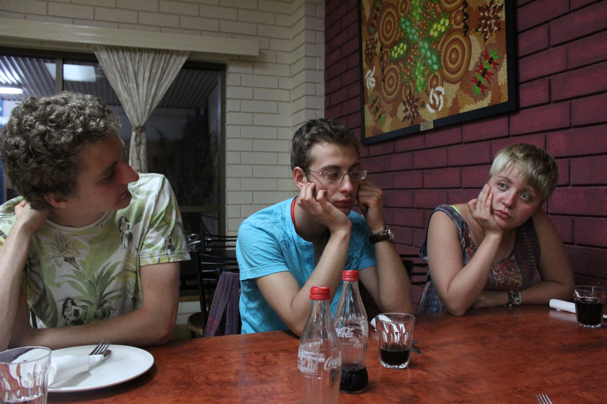
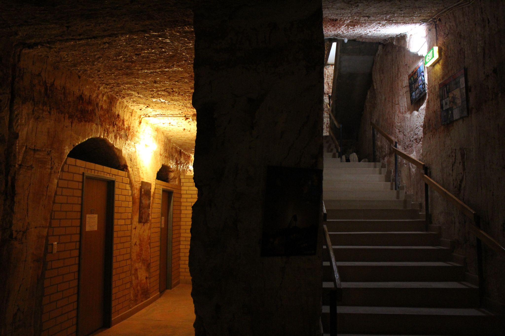

[Navigation](/posts/30-der-stuart-highway/)

Previous: [Uluru - A rock that still impresses](../day_09)

In the morning we woke up pretty early to see the first sun rays hitting Uluru
but as I said on my report for the previous day: I don't see the
difference. I was just confused and still sleepy. I would have liked to have
some extra hours of sleep instead. However, we took of and started one of our
longest stretches of that trip. It took us almost 10 hours to get to Coober
Pedy and we were all just dead tired once we arrived. We only made stops when
it was really necessary: toilet, fuel, state border.

One funny thing, that actually wasn't that funny was that we had to
surrender all vegetables and fruits at the state boarder. Once we crossed over
from Northern Territory to South Australia there were several warnings that it
is not permitted to import those into the state. That meant for us: taking a
break, eat everything and continue.

The eat everything turned out to be more challenging than we expected. We had
enough vegetables to survive the next two days and now we had to finish
everything within half an hour. One after another gave up. However, somehow we
did manage to finish everything.

On the road again: it was only a couple of more hours until we would arrive in
Coober Pedy. Though, the city already was announced by several open mines in
the landscape way before any civilization was in sight. Hills of sand at the
side of the road and as far as we could see marked the spots where miners were
digging for precious stones. What stones you ask? Well, Coober Pedy is renown
for its opals. The town is the largest opal mine in the world.

Since it was already late when we finally arrived in our hostel we decided to
postpone the exploration to the next morning.

We got up early, had breakfast, packed the car and went around town to see what
this opal fuzz was all about. Until today I am really not a fan of that place.
It feels all to dead and lifeless. Not many people are walking around and
everything seems like it was build for the sole purpose to serve the miners
temporarily but not lasting.

Next: [Adelaide – A break, some sleep, repacking](../day_11)
