[Navigation](/posts/30-der-stuart-highway/)

Previous:  [Kangaroo Island – A rough sea, a majestic view](../day_12)

The next morning we woke up and found out that the campground was next to a
huge meadow with kangaroos and wallabies grazing on. Me and Orion decided to
take a walk and explore the area.

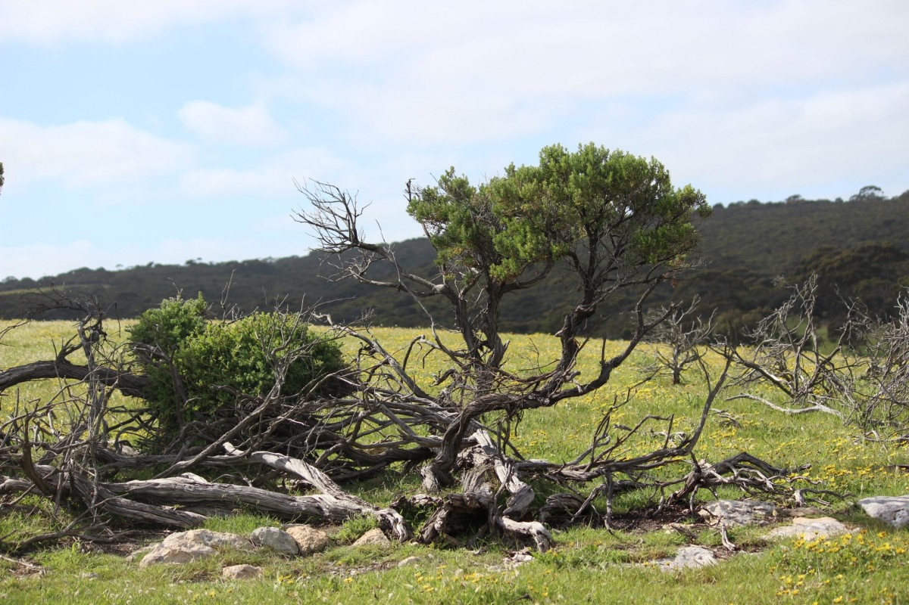

Kangaroo Island was just majestic and this blissful place was just the perfect
spot to get rid of the stress from crossing the desert. We used the day to come
down and enjoy the nature which was way greener than anything we experienced in
the past week.

After breakfast we went to the beach; Jamie went for a swim, me and Orion build
sandcastles and dams, Maddy read a book. It was all just too relaxing almost.

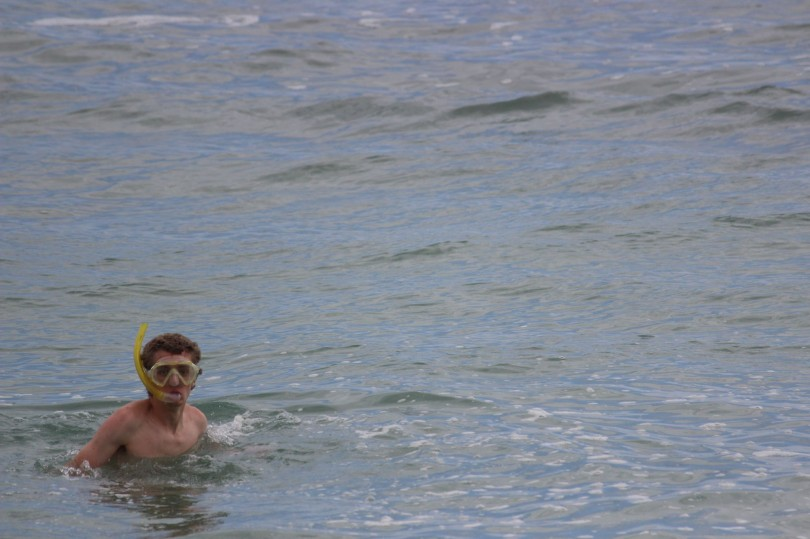
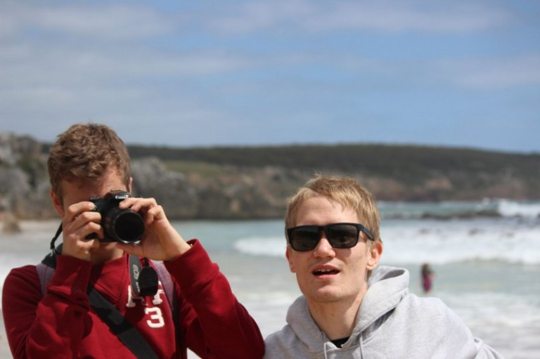
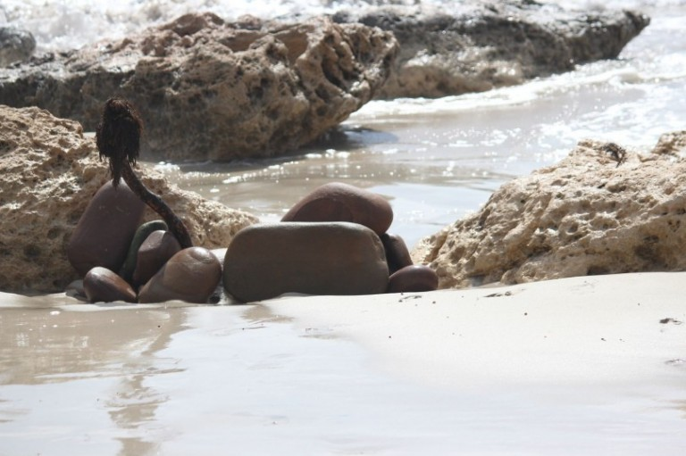
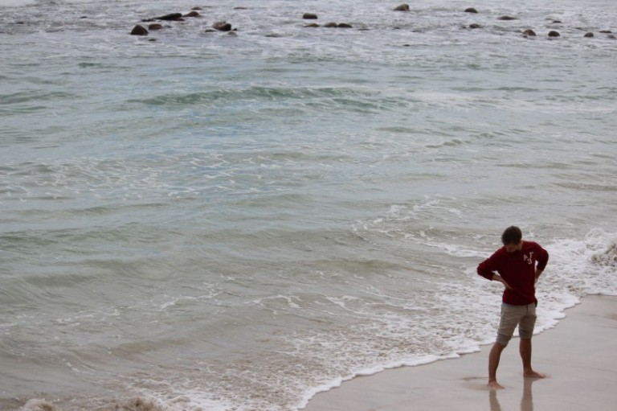
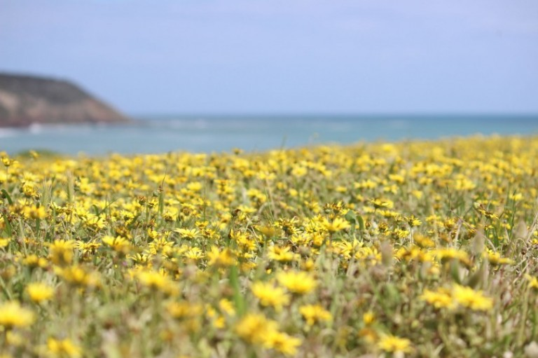
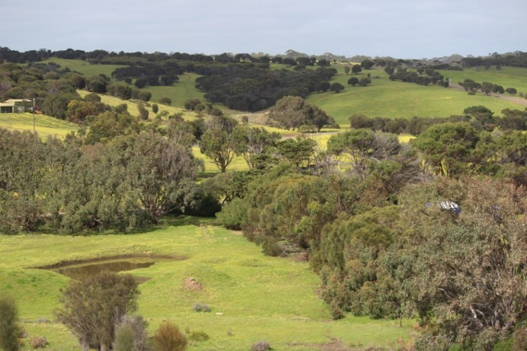
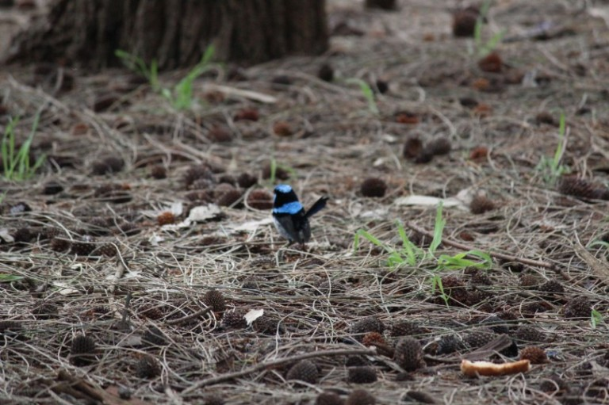
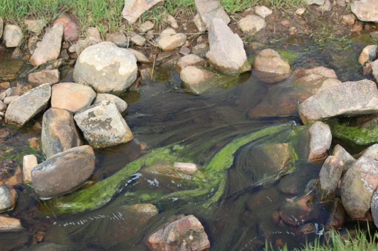
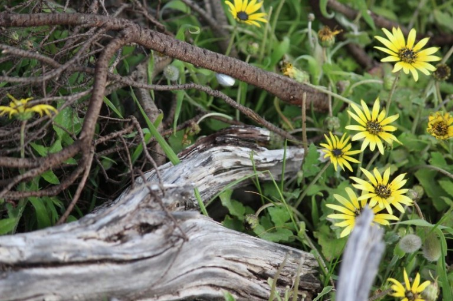
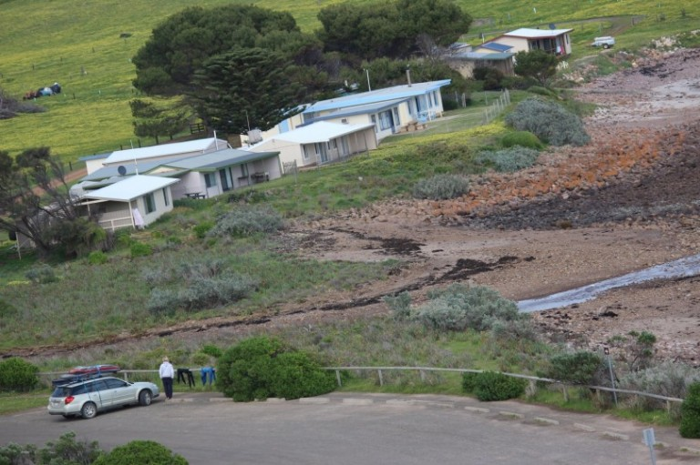
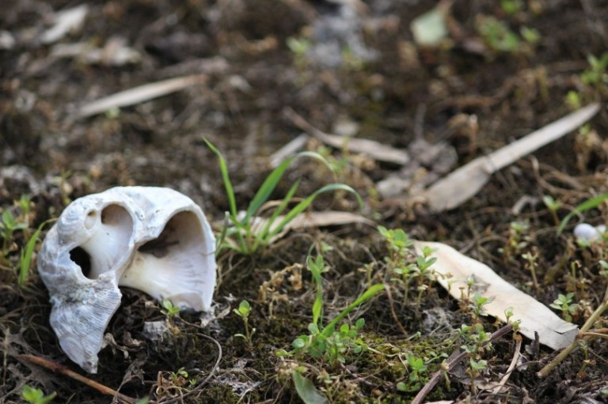
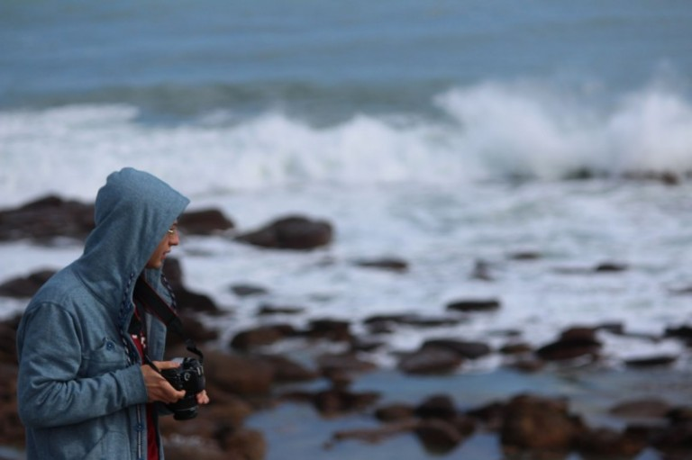
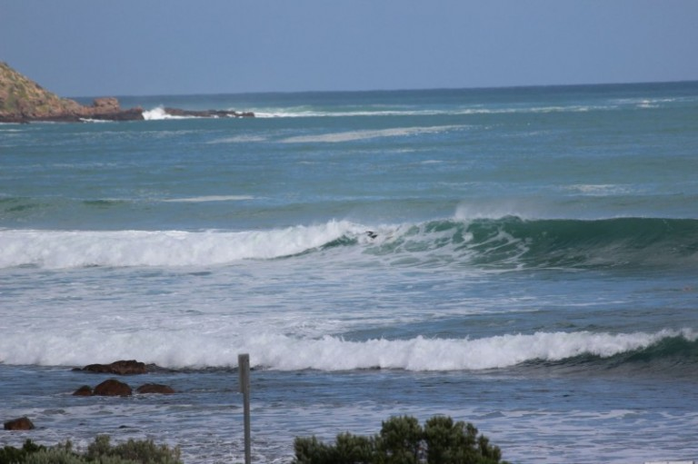
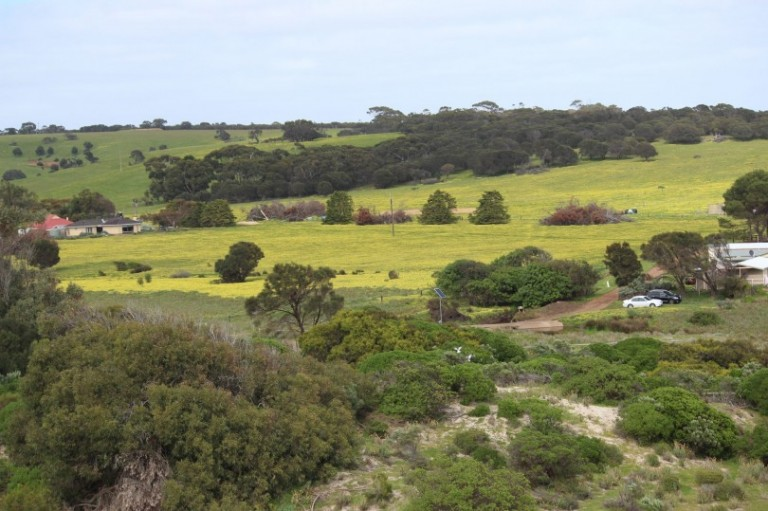

Next: [Kangaroo Island – Kangaroo, Koala, Lighthouse, Seal & Rocks](../day_14)
