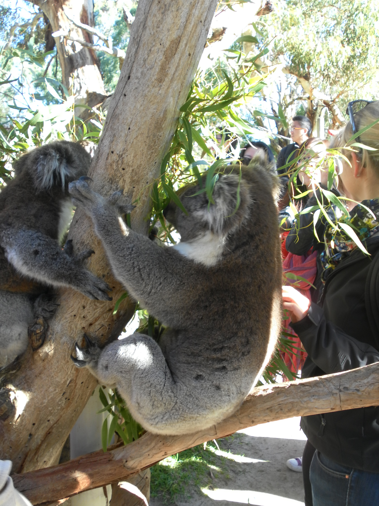
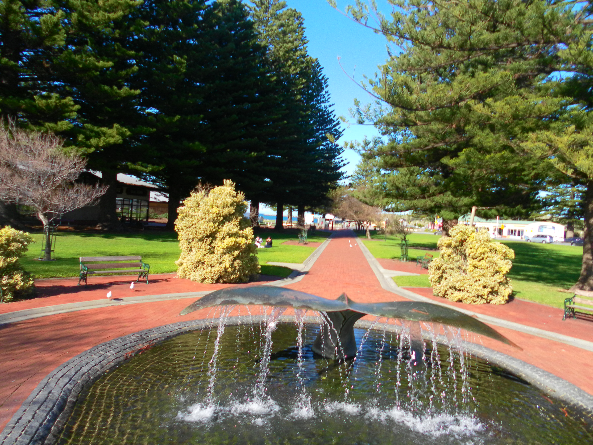
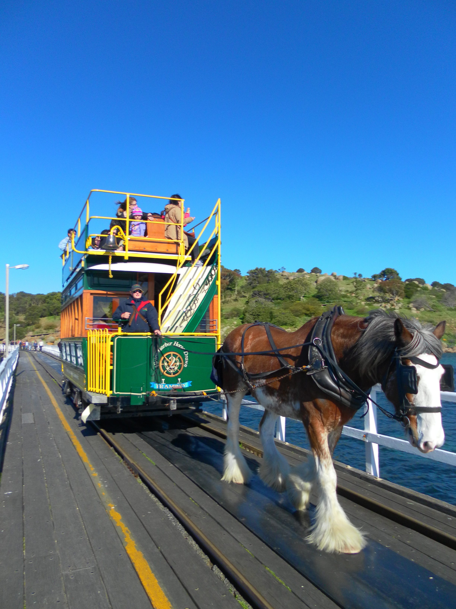
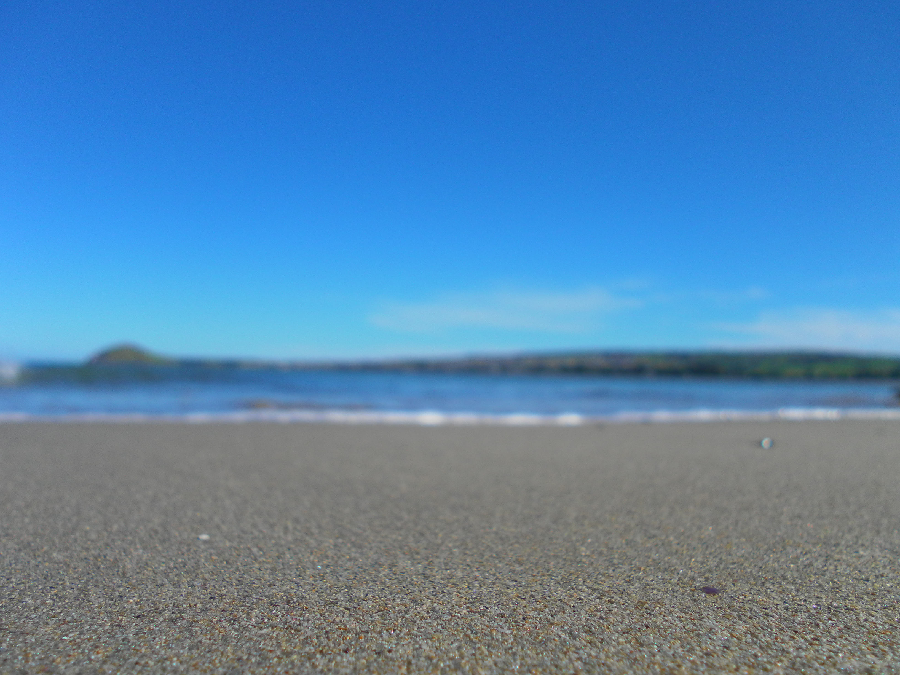
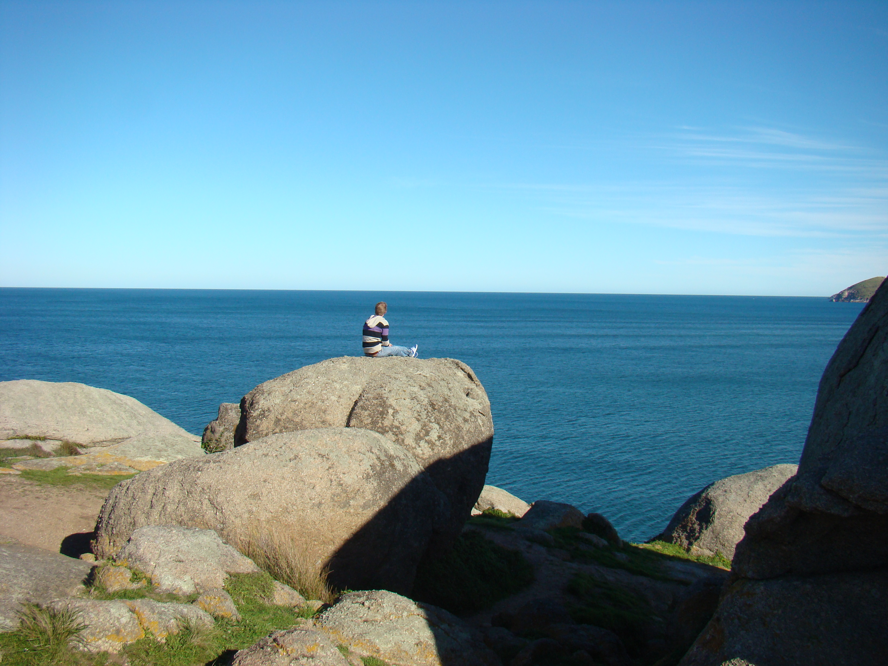

Die Einführungsphase an der Universität ist vorbei. Das bedeutet, dass ich die
letzte Woche damit verbracht habe semi-wichtige Vorlesungen zu besuchen und die
anderen internationalen Studenten kennen zu lernen. Am Freitag gab es jedoch
einen schönen Abschluss. Für nur $10 gab es einen Tagestrip in einen Tierpark,
der etwa 70km von Adelaide entfernt in den Hügeln liegt. Der Park war geradezu
perfekt, um einen Crashkurs in lokaler Artenvielfalt zu bekommen. Neben Koala
und Känguru gab es Emus, Wombats, Vögel und Reptilien. Das schöne am Park war
der riesige Freilauf für die Kängurus, die sich auf den Wiesen gesonnt haben.
Koala streicheln und fotografieren gab es auch. Allerdings sahen die kleinen
Beuteltiere reichlich überfordert aus, als auf einmal 200 Studenten um sie
herum verteilt waren.

Nach dem Tierpark ging es weiter in die kleine Hafenstadt Victor Harbour.
Historisch ein wichtiger Ort für Australien und fotografisch ein Traum, war es
echt schön die letzten Stunden durch die Stadt zu laufen. Im 19. Jahrhundert
trafen an dem Ort britische und französische Kartographen zusammen und
vollendeten die Weltkarte. Ein weiteres kleines Highlight war der Blick
Richtung Antarktis. Victor Harbour ist zwar nicht der südlichste Punkt
Australiens aber es liegt keine  Landmasse zwischen der Stadt und dem
südlichsten Kontinent.

