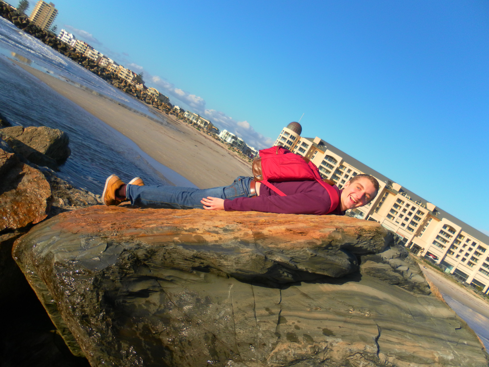

Der Kulturschock - Ein Phänomen, das oft erwähnt beschrieben und vor gewarnt
wird. Egal wie viel Freunde, Familie und Fremde darüber erzählen, es bleibt
doch eine recht persönliche Sache. Man erwartet es zwar aber wenn es einen dann
trifft ist es anders als gedacht. Da ich das auf den Philippinen in 2010 schon
einmal erlebt hatte wie das ganze aussieht hab ich gedacht, dass ich diesmal
schlauer bin und hoffentlich davon verschont bleibe. Es hat alles nichts
geholfen. Der Schock kam und ich war wiedermal unvorbereitet. Wie kann man für
etwas vorbereitet sein, dass man selber nie erlebt hat und das so abstrakt ist?

Bis Juli habe ich meine gesamte akademische Karriere (wenn man es Karriere
nennen kann) am UCM verbracht. Ein sehr einzigartiger Ort wie ich
herausgefunden habe. Wie auch immer, Ich hab schon oft jenes angenommen aber
nie wirklich hundert Prozent geglaubt, da ich keinen wirklich Vergleich hatte.
Der Einfachheit halber, lass uns einfach mal annehmen, dass ich eine bestimmte
Lernkultur gewohnt bin.

Die UCM-Kultur besteht aus 2 Säulen. Die erste Säule sind die Studenten und die
zweite die Mitarbeiter. Was die Studenten angeht ist es wichtig zu erwähnen,
dass wir alle auf unsere eigene Art und Weise ambitioniert sind. Wir wollen UCM
mit einem guten Abschluss hinter uns bringen (Die anderen verlassen uns
meistens nach dem ersten oder zweiten Semester). Dazu kommt, dass jeder, der
mindestens einmal auf der Abschlusszeremonie war, einfach davon überwältigt und
eingeschüchtert ist zu sehen mit welch guten Noten der Jahrgang abschließt.
Trotz des Drucks und der Ambitionen viel zu tun, sind wir dennoch froh, wenn
wir mal ein bisschen Ablenkung bekommen. In Verbindung mit den lebhaften,
ambitionierten und facettenreichen Studenten stehen die Mitarbeiter vom UCM.
Ich muss zugeben, dass ich nicht immer ganz verstanden habe, was am UCM hinter
verschlossenen Türen besprochen und entschieden wurde. Ich hatte das Gefühl von
einer Blackbox zu lernen und hatte mehr Transparenz erhofft.

Dieses Weltbild wurde aber in der Luft zerrissen. Jetzt bin ich teil eines
Uhrwerks, das einfach vor sich her rattert. Ich bin geschockt. Der Kulturschock
kam aber so wie ich meine soziale Seite versucht habe auf einen Kulturschock
vor zu bereiten bekam ich ein Messer in den Rücken. An einer Universität zu
studieren, die 25.000 Studenten hat, bedeutet viele Kompromisse. Man ist den
Professoren und Dozenten bei weitem nicht so nahe wie am UCM. Ich sitze in
meinen Vorlesungen jetzt mit mehreren hundert Studenten wobei ich am UCM nur in
zwei Kursen erlebt habe, dass unser 100-Mann Vorlesungssaal nicht ausreichte.
Wenn das UCM eine Blackbox ist, dann ist die Universität hier ein Schwarzes
Loch.

Und lass mich gar nicht erst anfangen mit den Studenten. Gerade will ich
einfach gemütlich im Gemeinschaftsraum vom UCM sitzen und hunderte von Seiten
über Politik lesen.

Zum Schluss genießt noch mal ein paar Bilder, die nichts mit diesem Beitrag zu
tun haben. Das erste ist ein Bild von meinem Haus, gefolgt von ein paar Bildern
vom Strand in Glenelg (lest es rückwärts!).

