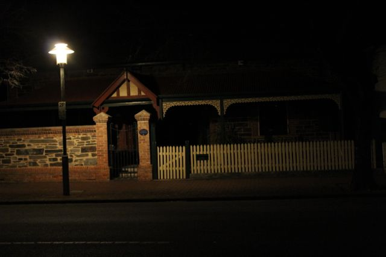

Warum ich in Australien bin habt ihr sicher schon an Hand meiner vorherigen
Einträge erahnt, aber was ich überhaupt hier mache, davon hab ich noch gar
nichts erzählt. Aus dem Grund hab ich mir gedacht, dass ich eine kurze
Exkursion in meine Kurswahl mache und eben kurz erkläre, was das alles so ist.

# Cognitive Science

Da es am UCM Pflicht ist mindestens 2 Kurse aus jeder Konzentration zu nehmen,
so musste auch ich mich damit Anfreunden aus den künstlerisch philosophischen
Lehren etwas zu wählen. Die drei Konzentrationen am College sind Humanities
(Kunst und Philosophie), Social Science(Geisteswissenschaften und Politik) und
Science (Natur- und Computerwissenschaften). Bisher habe ich viel
Computerwissenschaften mit Psychologie gemixt und bin hanz froh mit der
Mischung und von daher hatte ich nur das Problem meine Humanities-Kurse zu
vervollständigen. Dabei kam der Kurs hier in Adelaide wie gerufen. Es ist ein
philosophischer Ansatz, den heutigen Stand in künstlicher und natürlicher
Intelligenz zu hinterfragen und erklären. Wie denkt der Mensch? Wie
organisieren wir Wissen? Welche Methoden nutzen wir, um Situationen zu berechnen?

# Systems Programming in C/C++

Am UCM hab ich zwar schon einige Programmierkurse belegt, jedoch bisher nur in
Java, einer relativ jungen Sprache, die immer mehr an Popularität gewinnt. Ich
hab schon seit einigen Jahren überlegt mal eine neue Sprache zu lernen, da ich
Java nun schon seit 6 Jahren benutze. Auf den Philippinen hab ich dann versucht
mir selber C++ bei zu bringen, um etwas effizientere Programme zu schreiben,
anfangs lief es ganz gut, doch mir hat die nötige Disziplin und ein
vernünftiger Lehrer, den ich mit Fragen bombardieren konnte, gefehlt. In diesem
Kurs haben wir am Anfang viel Grundlegendes über UNIX-Systeme gelernt. UNIX ist
ein Systemkoncept, dass die Grundlage für Linux und Mac OSX (Apple) ist. Für
den Rest des Kurses beschäftigen wir uns C, eine der ältesten noch benutzten
Programmiersprachen, zu lernen. C ist eine unglaublich komplexe und
problematische Programmiersprache, da sie auf die meisten Sicherungen
verzichtet, um so effizient wie möglich zu sein. Es ist ein bisschen wie
Bergsteigen ohne Sicherungsseil. Man spart sich das zeitaufwendige Absichern,
jedoch ein Fehltritt kann zum Verderben führen. Am Computer sind dies
Systemabstürze und Speicherfresser. Ihr kennt alle die Absturznachricht von
Windows.

# Event Driven Computing

Ein weiterer Computer Kurs. Event Driven Computing ist eine der wichtigsten 
Konzepte in der Programmierung. Von Fernsehern über Fahrstühle bis hin zu 
Bremssystemen in Autos, all das wird heutzutage über Events geregelt. Der Kurs
ist eine gute Ergänzung zu meinen bisherigen Computer Science Kursen, von denen
die meisten Event Driven Computing angeschnitten haben. Bisher hatte ich jedoch
noch keinen Kurs, der intensiv über das Thema gesprochen hat und sich
ausschließlich damit befasst.

# Astronomy

Was erwartet uns außerhalb unserer Atmosphäre? Was kann man erreichen, wenn man
versteht was hinter unserem begrenzten Horizont passiert? Die fragen haben mich
schon immer interessiert. Jeder der mich kennt weiß wie begeistert ich von
Naturwissenschaften bin. Ich atme Artikel und neuste Forschungen wie jeder
andere Sauerstoff. Jedoch hat es nie für mich gereicht, um ein volles Studium
in einem der Bereiche zu machen. Ich finde es atemberaubend, wenn man neue
Galaxien entdeckt und feststellt was in den zahlreichen Sonnen passiert, die
wir Sterne nennen. Für mich gehört das alles zu den Grundkenntnissen und
anstatt Zeit mit Religionskunde in der Schule zu verschwenden sollte so etwas
viel eher Einzug in die Lehrpläne bekommen. Wir leben in einer Welt, in der die
Existenz von Göttern immer unwahrscheinlicher wird und anstatt an konservativen
Ideen fest zu halten, sollten wir lieber gucken, wie wir den einzigen Planeten,
der in unserer Nähe bewohnbar ist, vor der Zerstörung retten. Von daher war es
für mich ein Traum, der in Erfüllung ging, als ich feststellte, dass ich
Astronomie hier an der Uni belegen kann. In diesem Kurs lernen wir das
grundlegenden Wissen in der Astronomie. Was ist Nuklearfusion? Wie entstehen
Elemente? Welche Techniken benutzen wir, um Sterne zu erforschen? Wie entstehen
Galaxien und Sonnensysteme? All das und noch viel mehr sauge ich jede Woche auf
und ich liebe es einfach, in der Vorlesung zu sitzen und meinem Professor zu zuhören.

Die meisten Bilder haben nichts mit dem Thema zu tun und haben einfach so ihren Weg in den Artikel gefunden.
