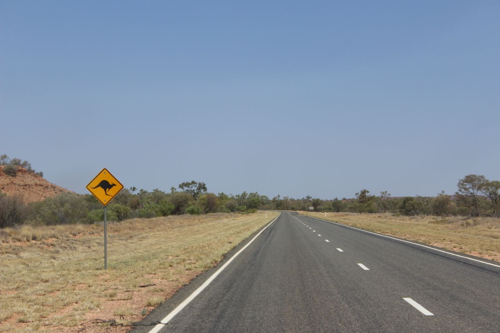

It was a rainy Saturday morning in Adelaide. Two men were waiting in a car in
the CBD of Adelaide outside the University Accommodation on Grote Street. I was
one of them, the other one was my housemate, Richard. We were waiting for 
Maddy, a girl from Newcastle, UK. My housemate did us a favor and gave us a 
lift to the airport on that sad-looking Saturday. The airport was the meeting
point on that Saturday for a group of 5 people (Lin, Maddy, Orion, Jamie and
I). We had one goal that brought us together: see as much of Australia as we
can in the short 2 weeks that we had for our mid-semester break. We were all
grateful for that break from the dull work at Uni and an opportunity to break
free from every-day life. Where were we heading? Our Aim that Saturday morning
was Darwin, NT. A city on the northern tip of Australia, the capital of
Northern Territory. The reason we were heading that way was our joined goal:
start in the north, get to the south - by land. In the upcoming post I will
describe and relive the 2 weeks that I spent seeing some of the most remarkable
sights I have ever seen. It was filled with joy, anger, fatigue, activity,
boredom and excitement. I learned a lot for the future and had enlightening
discussions with people I met.

Day 1: [Darwin - Tasting Crocodile](/stuart_highway/day_1)

Day 2: [Darwin - Mindil Beach](/stuart_highway/day_2)

Day 3: [To Litchfield - The Wicked Experience](/stuart_highway/day_3)

Day 4: [In Litchfield - Of Waterfalls and basking](/stuart_highway/day_4)

Day 5: [Mataranka - Swimming with crocodiles](/stuart_highway/day_5)

Day 6: [Devil's Marbles - A day in the car to see the sunset](/stuart_highway/day_6)

Day 7: [Alice Springs - Refreshing, getting back on track](/stuart_highway/day_7)

Day 8: [King's Canyon - A thunderstorm in the evening](/stuart_highway/day_8)

Day 9: [Uluru - A rock that still impresses](/stuart_highway/day_9)

Day 10: [Coober Pedy - Precious stones that rule the world](/stuart_highway/day_10)

Day 11: [Adelaide - A break, some sleep, repacking](/stuart_highway/day_11)

Day 12: [Kangaroo Island - A rough sea, a majestic view](/stuart_highway/day_12)

Day 13: [Kangaroo Island - Waking up in paradise](/stuart_highway/day_13)

Day 14: [Kangaroo Island - Kangaroo, Koala, Lighthouse, Seal & Rocks](/stuart_highway/day_14)

Day 15: [Adelaide - Time to relax](/stuart_highway/day_15)

