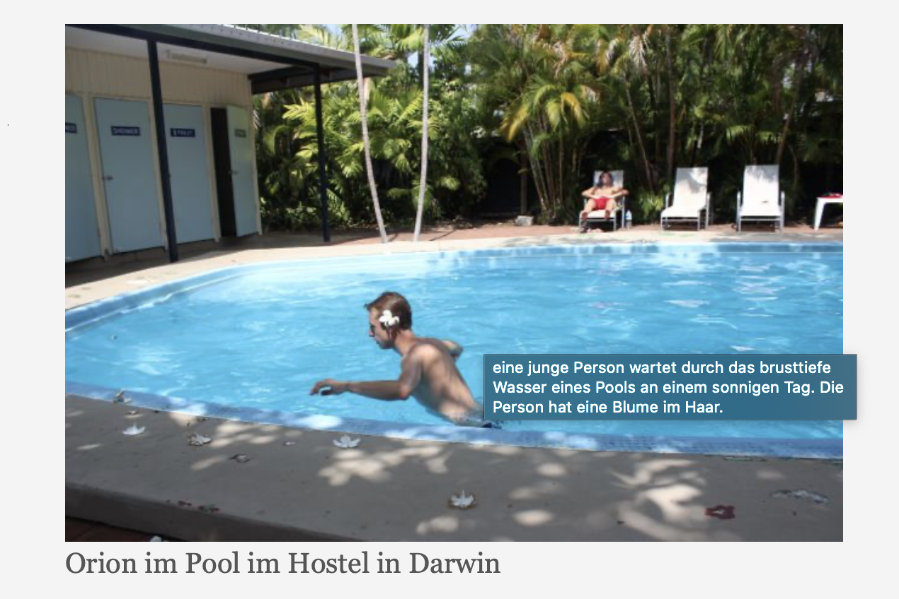

Ich benutze jetzt schon ne Weile [Hugo](https://gohugo.io) für meinen blog und
suche schon fast genauso lange nach einer eleganten Art und Weise, um den Blog
für verschiedene Bildschirmgrößen zu optimieren. Ich hab vor ein paar Monaten
einen [Post](https://laurakalbag.com/processing-responsive-images-with-hugo/)
dazsu gefunden, wie man mit Image Processing direkt mit Hugo ein Responsive
Design bauen kann. Es war eine super Möglichkeit, das ganze zu erreichen was ich
vorhatte und gleichzeitig mein erster Kontakt in Hugo direkt Dinge zu bauen. Nachdem
ich jetzt also mehrere Monate die Lösung auf meinem Blog verwendet habe, habe
ich mir vorgenommen das ganze mal selber zu versuchen. Ich bin kurz vorher auf
[Hugo modules](https://gohugo.io/hugo-modules/use-modules/) gestoßen und dachte mir,
dass man das ganze vielleicht auch für andere benutzbar machen kann. Ich bin bei
meinen Recherchen dann auf [Markdown Render Hooks](https://gohugo.io/getting-started/configuration-markup/#markdown-render-hooks) gekommen und habe damit auch eine super Lösung gehabt.

Die Kombination der beiden ist sehr viel versprechend, um Hugo in die Richtung
zu erweitern. Die Lösung verändert nichts an der Art und Weise, wie ein Autor
seinen Inhalt wie gewohnt in Markdown verfasst und generiert automatisch HTML
`figure` Elemente inklusive Untertitel, Source Sets und Titel und ist auch mit
vielen Hugo Themes direkt kombinierbar.

# Wie man es benutzt
Um direkt loszulegen, füge einfach nur das Plugin in deiner `config.toml` hinzu
```toml
themes = ["github.com/jan-xyz/hugo-module-img-srcset"]
```

Wie schon gesagt, muss man beim Benutzen nichts weiter machen, als ein Bild
einzubinden, bei Bedarf noch mit Text und Titel
```markdown

```
und das Plugin generiert automatisch die verschiedenen Größen
```
$ ls -lh
-rw-r--r--  1 jan  staff   127K Oct 11 00:53 orion_hu3d03a01dcc18bc5be0e67db3d8d209a6_60130_1200x0_resize_q75_box.jpg
-rw-r--r--  1 jan  staff   180K Oct 11 00:53 orion_hu3d03a01dcc18bc5be0e67db3d8d209a6_60130_1500x0_resize_q75_box.jpg
-rw-r--r--  1 jan  staff    32K Oct 11 00:53 orion_hu3d03a01dcc18bc5be0e67db3d8d209a6_60130_500x0_resize_q75_box.jpg
-rw-r--r--  1 jan  staff    66K Oct 11 00:53 orion_hu3d03a01dcc18bc5be0e67db3d8d209a6_60130_800x0_resize_q75_box.jpg
```
und fügt diese den Site Resources hinzu und referenziert sie im injezierten HTML:
```html
<figure>
  <source media="(min-width:500px)" srcset="/pages/stuart_highway/day_01/images/orion_hu3d03a01dcc18bc5be0e67db3d8d209a6_60130_500x0_resize_q75_box.jpg">
  <source media="(min-width:800px)" srcset="/pages/stuart_highway/day_01/images/orion_hu3d03a01dcc18bc5be0e67db3d8d209a6_60130_800x0_resize_q75_box.jpg">
  <source media="(min-width:1200px)" srcset="/pages/stuart_highway/day_01/images/orion_hu3d03a01dcc18bc5be0e67db3d8d209a6_60130_1200x0_resize_q75_box.jpg">
  <source media="(min-width:1500px)" srcset="/pages/stuart_highway/day_01/images/orion_hu3d03a01dcc18bc5be0e67db3d8d209a6_60130_1500x0_resize_q75_box.jpg">
  
  <figcaption>Orion im Pool im Hostel in Darwin</figcaption>
</figure>
```
und das ist das Result:



