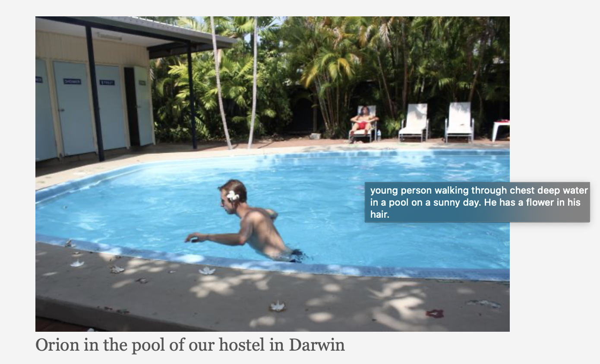

Since I started using [Hugo](https://gohugo.io) for my blog I was looking for
an easy way to optimize the website for different view port ratios and 
stumbled across [Laura Kalbag's post](https://laurakalbag.com/processing-responsive-images-with-hugo/)
on Image processing and responsive design with Hugo. It was definitely a great
starting point and exactly what I was looking for. After going with Laura's
solution for a few months now, I decided to have a go at it myself. Especially,
after finding out about [Hugo modules](https://gohugo.io/hugo-modules/use-modules/)
and [Markdown Render Hooks](https://gohugo.io/getting-started/configuration-markup/#markdown-render-hooks).

Those two combined sounded promising to make responsive images reusable and easy.
In the end the solution turned out quite nice. It doesn't change the way you interact
with images in Markdown and generates an HTML `figure` including captions, source sets
and title texts with support of any Hugo theme out there.

# How to use it
If you are eager to get going and only try it out, go ahead and just add it to your
website hugo configuration: 

```toml
themes = ["github.com/jan-xyz/hugo-module-img-srcset"]
```

Using it is as simple as normal markdown and there is really not much to it.
You simply add your image with an optional text and title
```markdown

```
and the module automatically generates multiple sizes of the image,
```
$ ls -lh
-rw-r--r--  1 jan  staff   127K Oct 11 00:53 orion_hu3d03a01dcc18bc5be0e67db3d8d209a6_60130_1200x0_resize_q75_box.jpg
-rw-r--r--  1 jan  staff   180K Oct 11 00:53 orion_hu3d03a01dcc18bc5be0e67db3d8d209a6_60130_1500x0_resize_q75_box.jpg
-rw-r--r--  1 jan  staff    32K Oct 11 00:53 orion_hu3d03a01dcc18bc5be0e67db3d8d209a6_60130_500x0_resize_q75_box.jpg
-rw-r--r--  1 jan  staff    66K Oct 11 00:53 orion_hu3d03a01dcc18bc5be0e67db3d8d209a6_60130_800x0_resize_q75_box.jpg
```
and adds those to your resources and the references into the injected HTML:
```html
<figure>
  <source media="(min-width:500px)" srcset="/pages/stuart_highway/day_01/images/orion_hu3d03a01dcc18bc5be0e67db3d8d209a6_60130_500x0_resize_q75_box.jpg">
  <source media="(min-width:800px)" srcset="/pages/stuart_highway/day_01/images/orion_hu3d03a01dcc18bc5be0e67db3d8d209a6_60130_800x0_resize_q75_box.jpg">
  <source media="(min-width:1200px)" srcset="/pages/stuart_highway/day_01/images/orion_hu3d03a01dcc18bc5be0e67db3d8d209a6_60130_1200x0_resize_q75_box.jpg">
  <source media="(min-width:1500px)" srcset="/pages/stuart_highway/day_01/images/orion_hu3d03a01dcc18bc5be0e67db3d8d209a6_60130_1500x0_resize_q75_box.jpg">
  
    <figcaption>Orion in the pool of our hostel in Darwin</figcaption>
</figure>
```
and this is how it looks like:




# Implementation
To achieve this I heavily relied on features just recently implemented in Hugo.
The more important one is [Markdown Render Hooks](https://gohugo.io/getting-started/configuration-markup/#markdown-render-hooks).
These render hooks allow overwriting the markdown renderer for things like images,
links or headers. It allows me to overwrite the way the HTML for images is generated,
adding sourcesets and the figure caption. To do this, you simply place a file called
`render-image.html` inside the folder `layouts/_default/_markup/` which describes
how to render this image. The template you place in that folder receives a few
pieces of information, like the path (`.Destination`), text(`.Text`) or
title(`.Title`) entered into the Markdown code.

The other major feature supporting this plugin is actually the introduction of
[Hugo modules](https://gohugo.io/hugo-modules/use-modules/). These are modular pieces of a theme which can be combined. This
allows anyone to embed the render hook into their own website and benefit from
a more responsive experience on their Hugo website.

# Future work
The plugin itself is quite simple but allows for a few extra configuration
options. The most important one is probably making the view port and
image sizes configurable.
