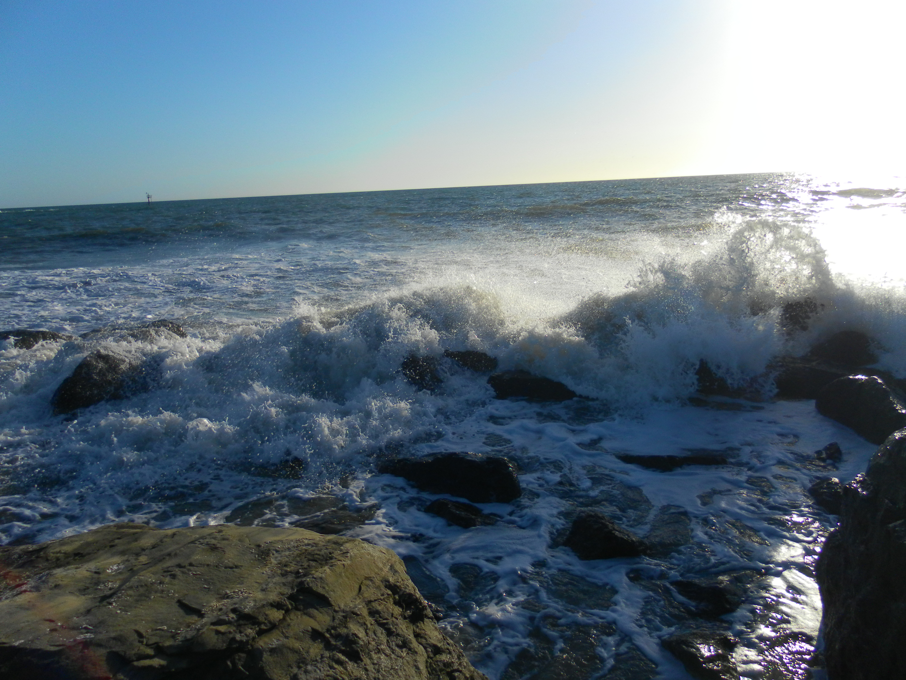
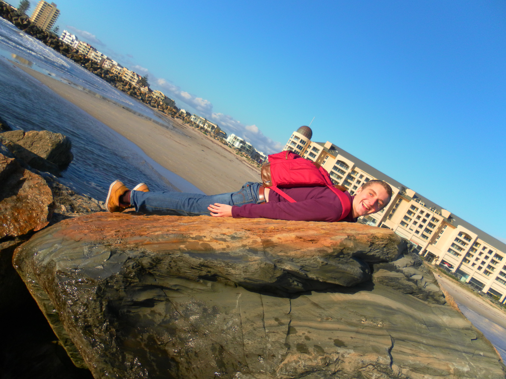

&nbsp;

You know everyone tells you that you will experience a culture shock once you move, travel or temporarily happen to be in a different culture than you are used to. I can safely say that I was prepared for it since I already had the pleasure of experiencing it back in 2010 when I spent some time in the Philippines. However, I wasn't prepared. How can you be prepared for something if you never experienced it? All the great stories and advices by friends, families and strangers couldn't explain your own feelings.

Until July I spent my entire academic career (if you can call it career) at UCM. A very unique place as I now found out. Well, I always kind of assumed that but you can never tell for sure until you get to actual experience yourself. Again, the same problem as above. So for simplicity, let's say that I am used to a different kind of culture.

The UCM culture has basically two pillars. The first one being the students and the second one being the staff. For the first pillar it is important to mention that we are all in our very individual way ambitious. We want to finish UCM (Those who don't usually leave after the first or second semester). And anyone who has been at a graduation ceremony feels intimidated by the incredible distinction the students achieved. Nevertheless, we are all happy when we get some distraction from the highly competitive and demanding surrounding (\*ough\*Alla\*cough\*). In junction with that very dynamic and vibrant part is the staff. I have to admit, I often thought about how irrational and closed the "other" side of UCM is. Sometimes I felt as if it was just a black box that I was learning from and it didn't feel as open as I had hoped for.

That world view got just torn apart. Being now part of a clockwork that rattles in its housing I got to say that I am shocked. The culture shock that I was waiting for came. As I was guarding myself social expectations I got stabbed in the back, so to say. Studying at a university with several thousands (just looked it up on Wikipedia: 25,000) means being in a lecture hall with at least a hundred while I only experienced it only in two courses at UCM that our 100-seat-lecture hall at was actually too small. I almost feel like a homeopathic cure for headache. Dropped into the water, firmly shaken, filtered, more water, filtered again and repeated until there is nothing left but water. There is nothing that connects the lecturer or course coordinator with the student base in anyway. Additionally, the tutorials are a joke. It isn't mandatory to go to and thus also not really helpful. If UCM is a black box than this is a black hole.

And don't get my started on the students' Right now, I just want my cozy common room and a few hundred pages about John Stuart Mill.

Finally, enjoy some picture that are totally unrelated. My house and a few pictures of the beach in Glenelg (Try reading it backwards!).

