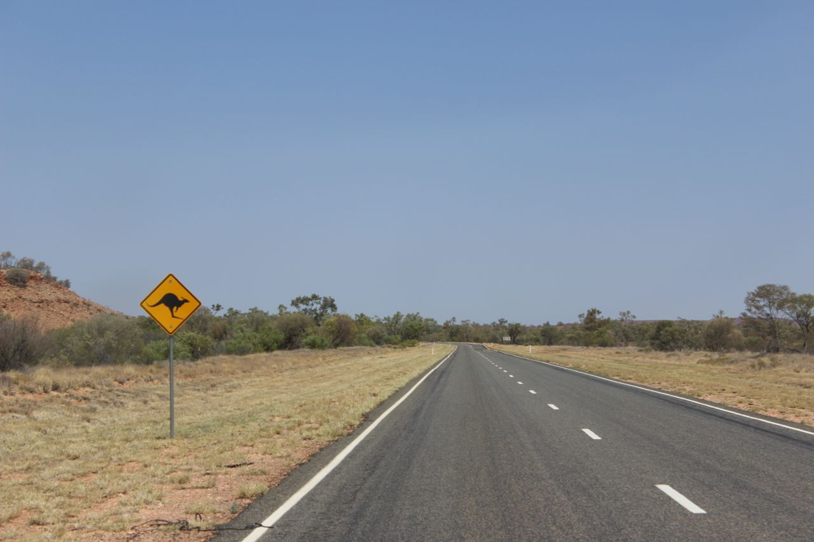

Es war ein regnerischer Samstag morgen in Adelaide. Zwei Männer warten in einem
Auto im Stadtzentrum von Adelaide, vor den Türen der Studentenunterkunft der
Universität in der Grote Street. Ich war einer von ihnen, der andere Mann ist
Mitbewohner Richard. Wir haben auf Maddy gewartet, einer Studentin aus
Newcastle, UK. Mein Mitbewohner tat uns den gefallen uns an dem nassen und
tristen Morgen zum Flughafen zu fahren. Der Flughafen war der Treffpunkt für 5
Leute (Lin, Maddy, Orion, Jamie und ich) an dem besagten Tag. Wir wollten so
viel wie möglich in den zwei Wochen Semesterferien von Australien sehen. Wir
waren alle überglücklich eine Pause vom Alltag zu bekommen. Wohin ging es für
uns? Unser Ziel an dem Samstag morgen war Darwin, NT. Eine Stadt an der
Nordspitze Australiens, die Haupstadt des Staates Northern Territory. Der Grund
für unsere Zusammenkunft war ein gemeinsames Ziel: Im Norden starten, im Süden
ankommen - über Land. Im folgenden Bericht werde ich beschreiben und
wiederbeleben was ich in den zwei Wochen erlebt habe. Es waren atemberaubende
Wunder der Natur und die kurze Reise war gefüllt mit Spaß, Wut, Müdigkeit,
Aktivität, Langeweile und Aufregung. Ich hab viel für die Zukunft gelernt und
hatte erleuchtende Diskussionen mit den Leuten, die ich getroffen habe.

Tag 1: [Darwin - Krokodilfleisch](
)

Tag 2: [Darwin - Der Mindil Beach](
)

Tag 3: [Nach Litchfield - Das Wicked Erlebnis](
)

Tag 4: [In Litchfield - Von Wasserfällen und Sonnenbaden](
)

Tag 5: [Mataranka - Planschen mit Krokodilen](
)

Tag 6: [Devil's Marbles - Ein Tag im Auto bis zum Sonnenuntergang](
)

Tag 7: [Alice Springs - Auffrischen und weiter geht's!](
)

Tag 8: [King's Canyon - Ein Gewitter am Abend](
)

Tag 9: [Uluru - Ein Felsen, der mich immer noch beeindruckt](
)

Tag 10: [Coober Pedy - Edelsteine, die die Welt regieren](
)

Tag 11: [Adelaide - Ein Stopp, ein bisschen Schlaf und neues packen](
)

Tag 12: [Kangaroo Island - Aufgewühlte See, ein majestätischer Anblick](
)

Tag 13: [Kangaroo Island - Erwachen im Paradies](
)

Tag 14: [Kangaroo Island - Känguru, Koala, Leuchtturm, Robben & Felsen](
)

Tag 15: [Adelaide - Zeit zum Entspannen](
)

