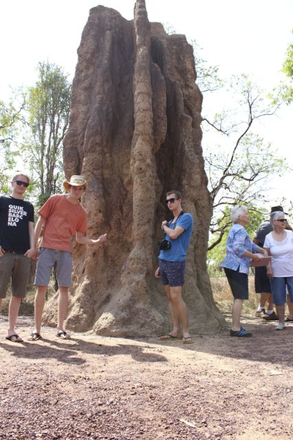
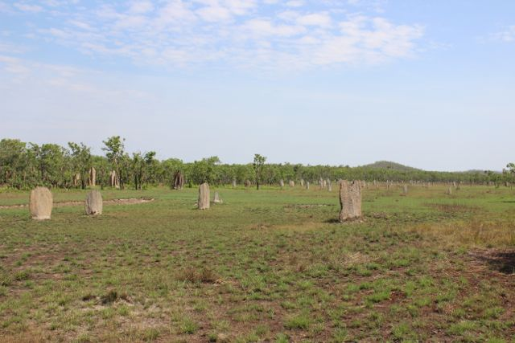
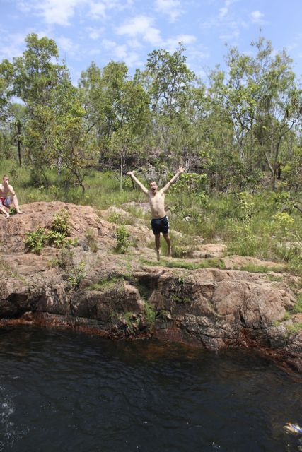
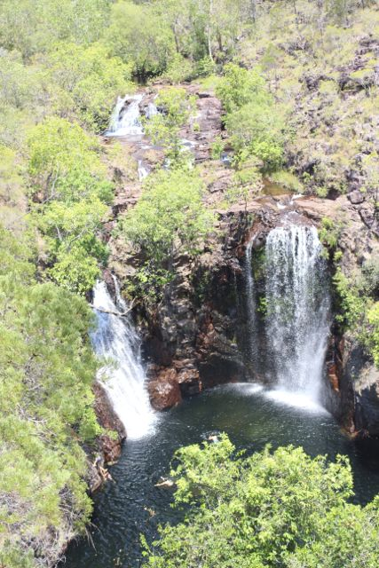
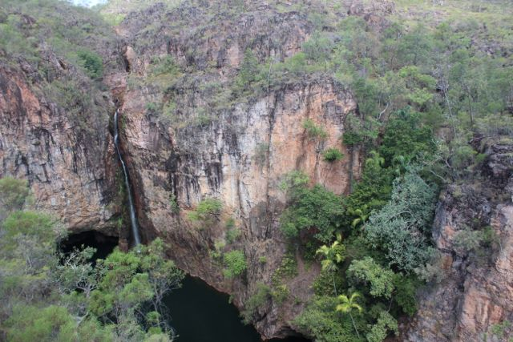
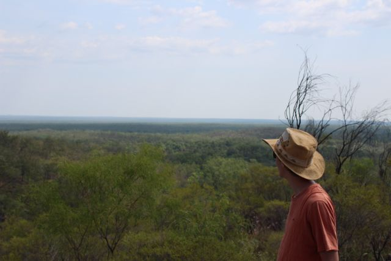
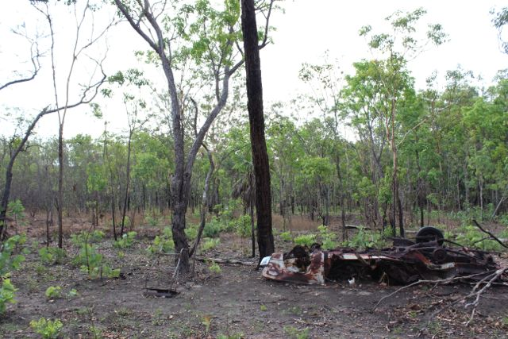
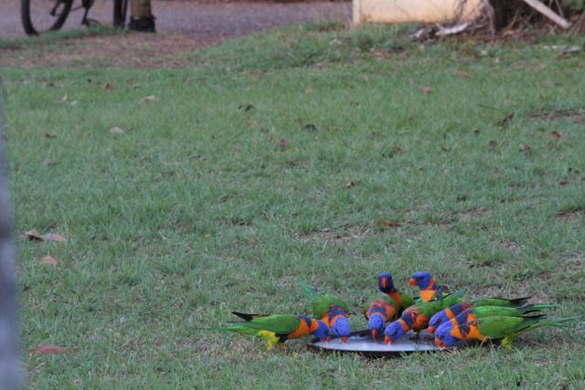

[Navigation](/posts/30-der-stuart-highway/)

Previous: [To Litchfield – The Wicked Experience](../day_03)

The first night camping was surprisingly easy. Everyone woke up more or less on
time. Some of us had difficulties keeping the time that we decided on the night
before, and I being me got a little nervous not being in time. However, after
finishing their coffee everyone was ready to board the bus and we managed to
leave the campsite only with a slight delay. We left most of our stuff in the
girls' tent since we would spent the next night on the very same campsite.

The Park was just plain impressive, we decided to go to Litchfield instead of
Kakadu National Park out of several reasons. Although Kakadu is the better
known park and is said to have impressive aboriginal cave art, we decided to go
to the smaller of the two parks. The original plan included to go to Kakadu but
many locals in Darwin told us that Litchfield is nicer and that they usually go
to Litchfield for weekends. Additionally, Kakadu seemed to be just too big for
the short time we had. The tickets usually are valid for 2 weeks which gives
you already an idea on how vast it is. In contrast, Litchfield is just fraction
of the size, we managed to see most of the accessible parts in a day and the
entrance was free (YIIHAAA).

The first stop in the park was the magnetic termites. We were joking in the car
trying to make up stories why they might be called magnetic termites. Maybe
they are called like that because they attract people and when we get too close
they eat us alive. Nope, that's definitely not the reason. We will find
out. First of all we saw two giant termite mounds right at the car park that
were more than 4 meters high. Quite impressive if you keep in mind that
termites are ant-like, small insects, that crawl around on the floor. We made
sure that we get some awesome shots of the mounds before we proceeded to the
actual magnetic termites. We were fortunate enough that a group of seniors just
happened to have a tour guide who explained everything about the sight. The
termites in the giant mounds left it already several years ago (I think it was
a decade). Furthermore, the tour guide lifted the mystery about the magnetic
termites. They build their mounds aligned to the magnetic field of the Earth,
from north to south. That has the advantage that they escape the mid day heat
while the sun is at its highest. The field on which the termites build their
mounds felt a little bit like a grave yard with these perfectly aligned
tombstone-like structures.

At that point we were already feeling the heat again and it wasn't even
the hottest part of the day yet. We were craving for a cool pool to relax our
limbs in. Luckily the next sight was promising something similar. The Buley
Rockhole was our next stop in the park. We walked the small path from the car
park and as soon as Jamie saw the water he was out of sight. We got rid of
shirt and shoes and jumped into the refreshing water, Jamie somewhere further
upstream. We really enjoyed it, the weather was sunny and hot, the water was
perfectly tempered and runs over several 100 meters of rock before it
disappears in the jungle. The rocks formed several smaller and bigger holes
that were just perfect for swimming, jumping and relaxing, little waterfalls
ran into the pools on one side. We spend several hours in the water before we
decided to see more from the park.

The Buley Rockhole, after winding through a bit of forest, was actually turning
into a huge waterfall. The most impressive that I have ever seen in my life. I
haven't seen many but this was just pure beauty and another opportunity
for a perfect swim. We plunged around, jumped into the water and spend some
more time.

We were happy to see that most of the attractions in Litchfield seem to be
waterfalls so we headed our way and went to the next one. It was a little
bummer to actually find out that that one wasn't accessible for swimming.
However, it gave an impressive view on the waterfall as well as the surrounding
nature.

A look at our watch revealed that it was getting late and sun set was only in a
few ours, getting back to the campsite was already an hour trip. Since we now
spend most of our time swimming and hunting waterfalls we decided to see the
cultural side of Litchfield, an old tin mine at the northern tip. We were
expecting an impressive mine and were a bit confused when we missed it and
actually went too far. We turned around and find a tiny dirt road leading into
the bush. The girls were concerned about the insurance since we weren't
covered for unsealed roads. However, the road to the tin mine on the map was
promising only a short trip plus the road looked fit for our car. It was all
okay, the road was really just a couple of hundred meters, however, the tin
mine was merely a house with a hole in the ground. During the active time of
the mine the ground was covered with tin plates that the workers collected,
broke into pieces and sold.

The last stop for this day was checked, Orion took over the driving and brought
us safely home. It was really quite something to drive, it didn't feel
that long when we came here since we stopped every 20-15 minutes. Back at the
campsite we topped up for gas, and got a jerry can for free as the woman at the
countered didn't seem to know what she was doing, but we only recognized
that later and were even more happy.

Next: [Mataranka – Swimming with crocodiles](../day_05)
