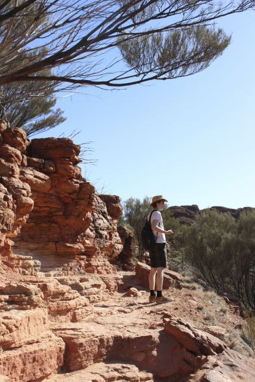
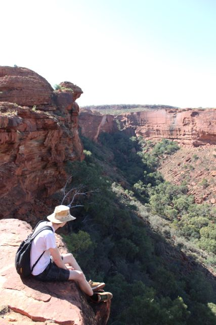
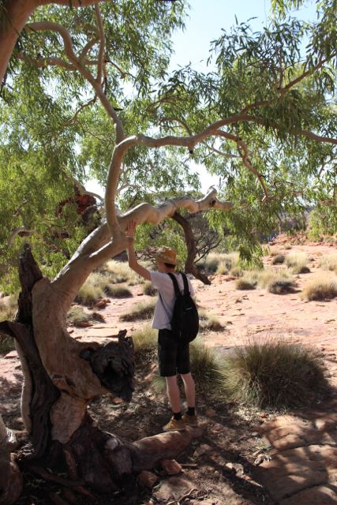
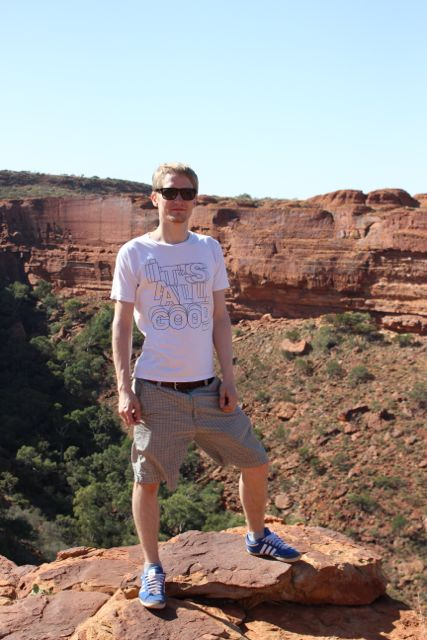
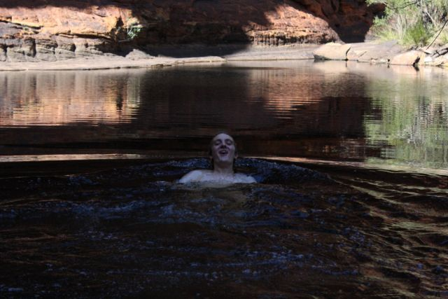
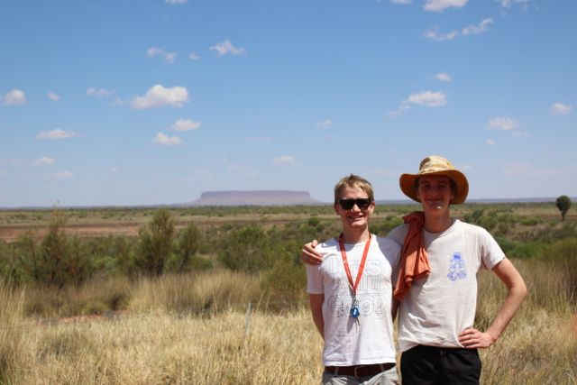
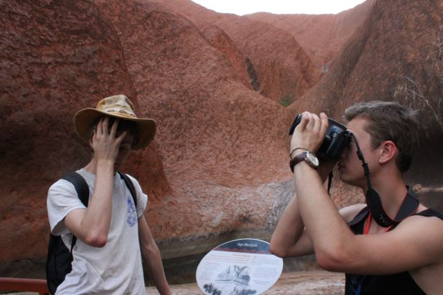

[Navigation](/posts/30-der-stuart-highway/)

Previous: [King's Canyon - A thunderstorm in the evening](../day_07)

Before we actually got to see Uluru we went to the Canyon that I talked about
already. The King's Canyon was really close to our campsite and had two
possible routs to take. Since the girl's didn't feel that way they stayed in
the open valley of the canyon while we went up and took a walk around. It was
an experience that was possibly one of the most memorable. From the weird rock
formations that were carved by wind and rain to the silent ponds in the valley
where Jamie took an unexpected bath it was simply a great way to start the day.

The walk around the rim of the canyon, down into the valley, up on the other
side and back on the rim on the other side took us approximately 3 hours. It
started with a pretty tough climb, Jamie was keeping us at pace and we overtook
several groups. One of them was a family with two kids that we met on the
campsite the day before already, while we were playing Frisbee and watching the
thunderstorm. On the rim we took some pictures, enjoyed the view and jumped
around from rock to rock. On the way through the valley to the other side of
the canyon we took a little detour to a small pond that formed in the shades of
the canyon walls. We were just sitting there, watching birds catching insects
while speeding over the pond's surface and talking to a stranger on the
canyon's rim some forty meters above us when Jamie suddenly took his shirt of
and jumped in. He took of his shorts and through them out, enjoying a skinny
dip in nature's clear waters to the enjoyment of the numerous girls around the
pond. after a while he came back out and we continued our walk. the other side
was much the same as the first and nothing in particular happened. Just an
amazing view into all directions.

We got back on the road and a few hours later saw the first rock showing up to
our left. Completely delusional, we expected it to be Uluru although we knew it
was still a couple 100km down the road. Later it turned out to be a different
Mountain. Let's not talk about this again. Embarrassing.

However, we made it to the magical rock in the red center, checked in at
Yulara, dropped of the girl's who wanted some quality time for themselves and
went to the Uluru National Park. It was mind blowing. On pictures it always
seems so small; It just looks like a small rock that just has a very red color.
No, it is way more than that. The rock is gigantic, the rock is smooth _and_ it
is red. It felt so weird to drive around it and see all the different facets of
it's texture and shape. Some parts were more rocky while others seemed like a
red sand dune. We took a small walk at the base of the rock as it was already
late and we wanted to see the sunset from one of the viewing spots along the
road.

Along the trails were several info posts that told the story of the aboriginal
believe that are connected to the rock's spiritual meaning. A ranger pointed
out some of the historical and geological aspects of the rock. Afterwards, we
went for a stroll around until we deemed it time to get to one of the viewing
spots. As we arrived at the car park we found already hundreds of cars lined up
to see the sunset. We found a good bay for our van and climbed on the roof to
get a good view. In my opinion it looks the same. Still, it is a breath taking
experience but the view at sunset, sunrise or day light is the same.

Next: [Coober Pedy - Precious stones that rule the world](../day_10)
