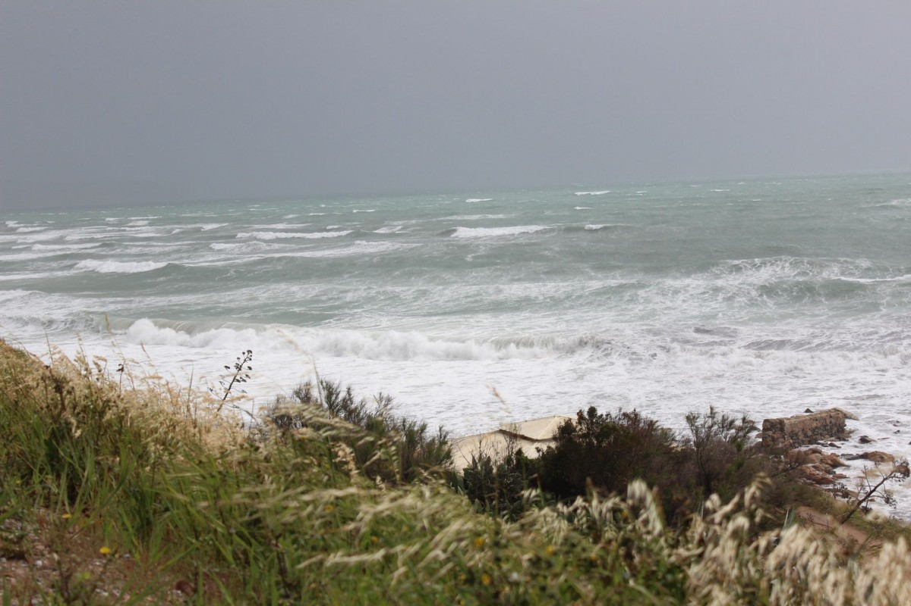
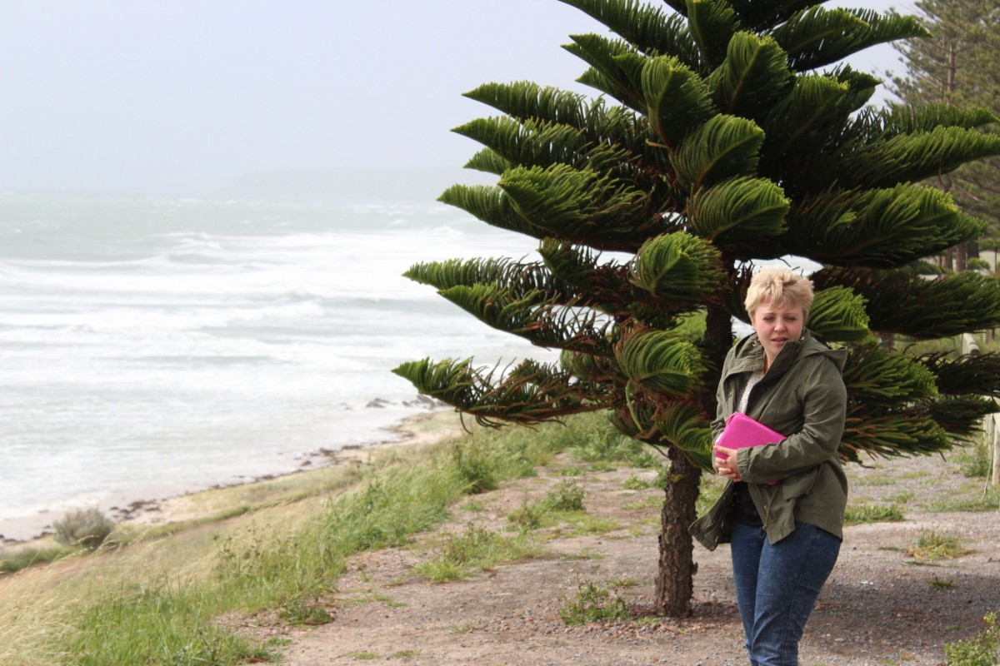
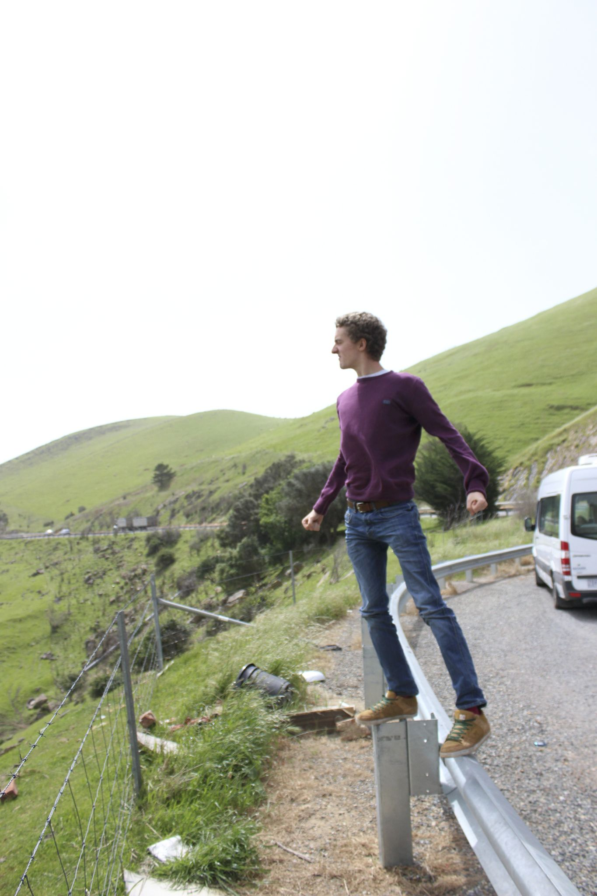
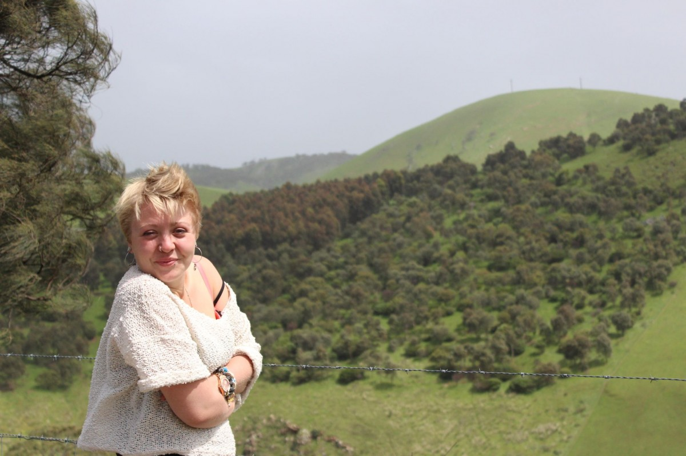
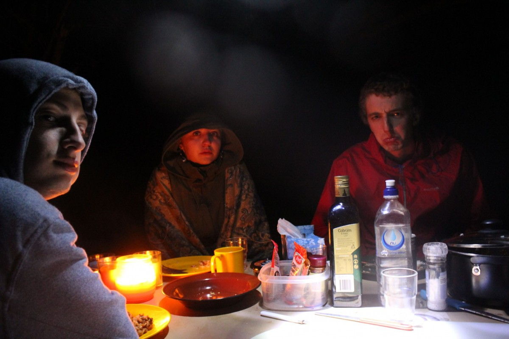

[Navigation](/posts/30-der-stuart-highway/)

Previous:  [Adelaide – A break, some sleep, repacking](../day_11)

The next morning didn't promise a lot. The closer we got the coast the
more windy it got and it started raining. However, we were prepared, had warm
cloth and jackets. After all: we were back in the moderate south and not the
warm and dry desert anymore.

After only an hour (which seems really short compared to the previous distances
we travelled) we arrived at the pier. We had to wait a little for the ferry so
we decided to use the time for a lunch. Somehow we got used to the same lunch
over the last couple of days: sandwich with cheese, cucumber, tomato and
spices.

Finally, the ferry arrived. However, most people did not seem to enjoy the
rough ride. No matter where you were there were people re-experiencing their
lunch. None of us though. We managed to keep our sandwiches inside and arrived
healthy and happy on the island.

We read of a nice camping ground right at the beach so we made our way through
the jungle of that wonderful island.

<video controls="controls">
<source type="video/mp4" src="./videos/middle_of_nowhere.m4v" />
</video>

We made it to our campsite. It was completely empty, and only a small hut with
toilets, no showers and pure peacefulness. We set up camp and enjoyed the night
at the beach watching stars, listening to the waves. It was paradise.

Next: [Kangaroo Island – Waking up in paradise](../day_13)
