[Navigation](/posts/30-der-stuart-highway/)

Vorher: [Kangaroo Island - Aufgewühlte See, ein majestätischer Anblick](../day_12)

Erst als wir am morgen aufwachten ist uns aufgefallen, dass unsere
Campingstelle neben einer riesigen Grasfläche mit Kängurus uns Wallabies war.
Orion und ich sind erstmal mit der Kamera losgezogen, um das Gelände zu
erkunden.

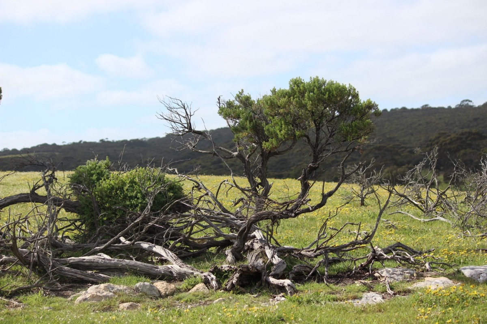

Kangaroo Island war ein unglaublich majestätischer und dieser unberührte Ort
war einfach der perfekte Ort um den Stress der Wüste von unseren Schultern zu
kriegen. Wir haben den Tag genutzt, um runter zu kommen und die Natur zu
genießen. Es war hier einfach grüner als alles andere, was wir bisher in dem
Urlaub erlebt hatten.

Nach dem Frühstück sind wir zum Strand aufgebrochen; Jamie ist gleich erstmal
schwimmen gegangen, Orion und ich haben ne Burg gebaut, Maddy hat gelesen. Das
alles war schon fast zu entspannt.

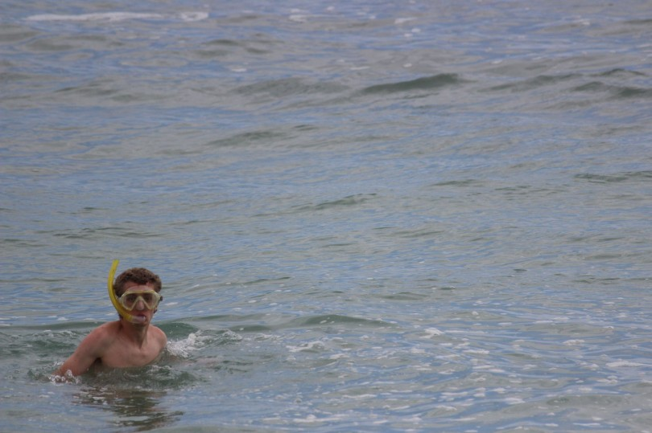
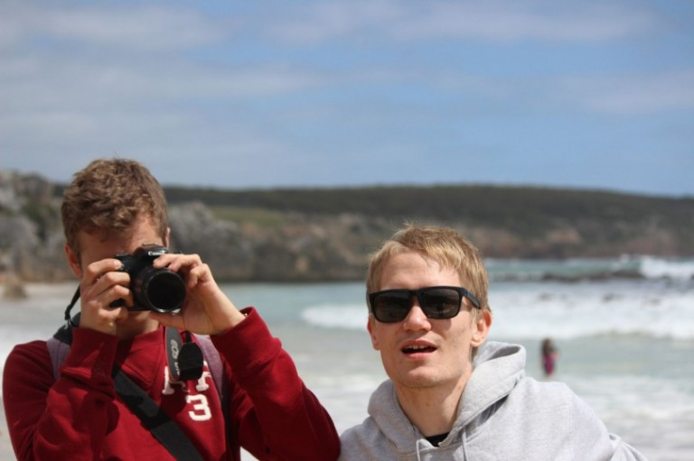
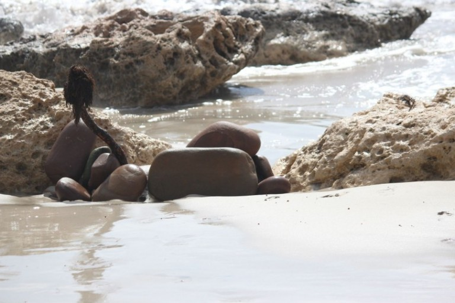
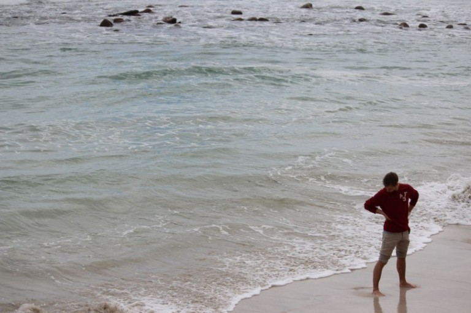
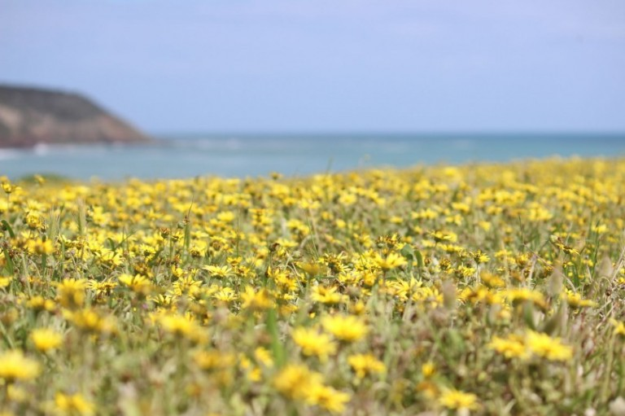
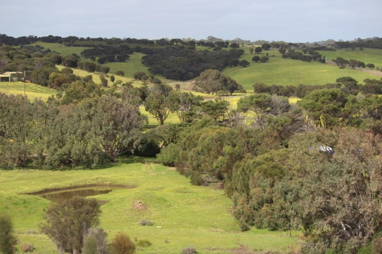
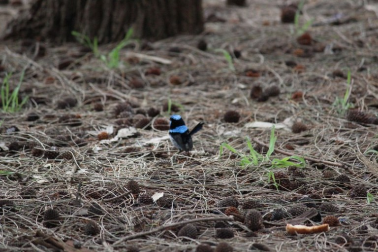
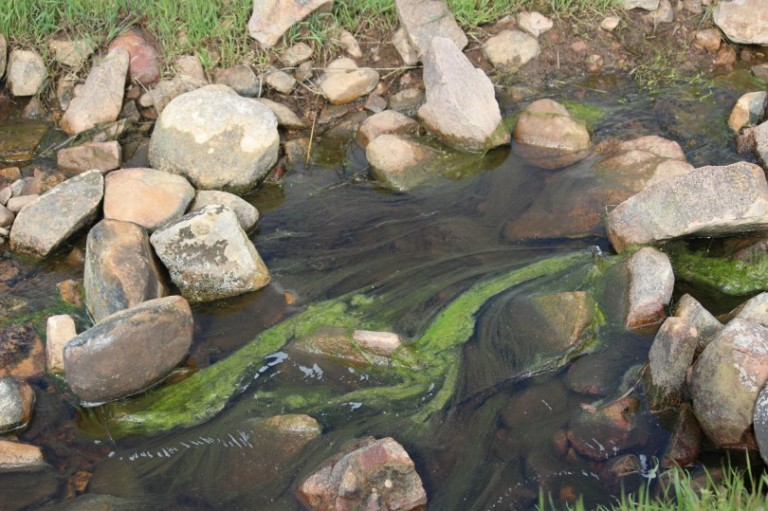
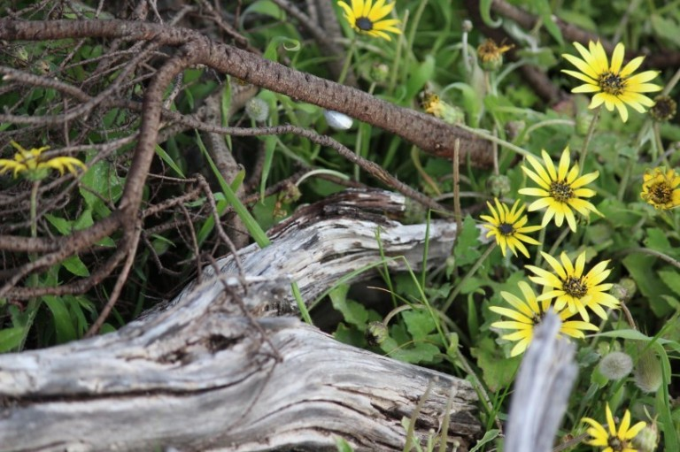
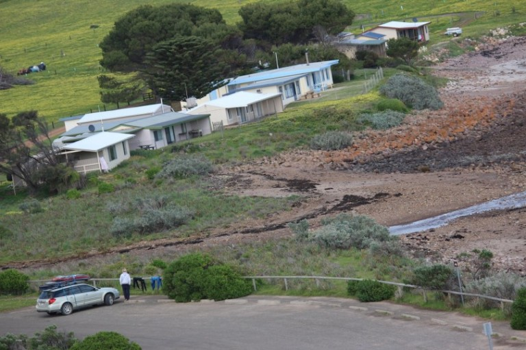
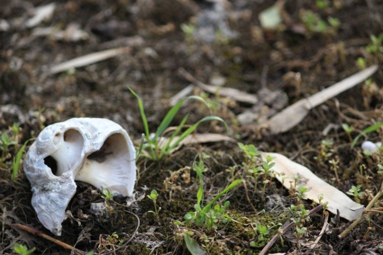
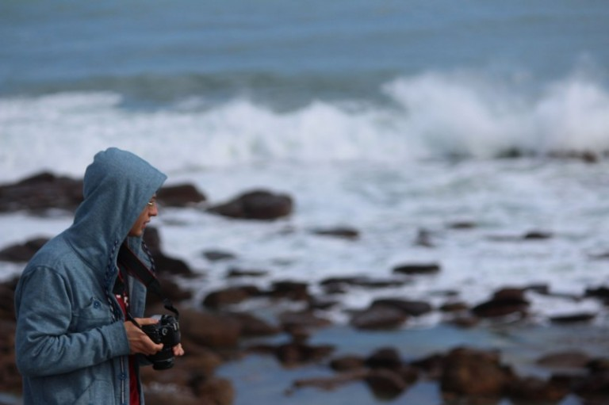
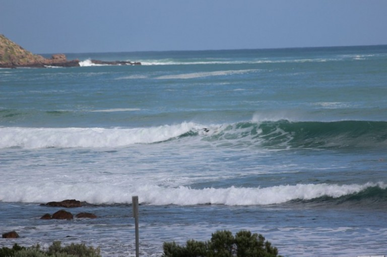
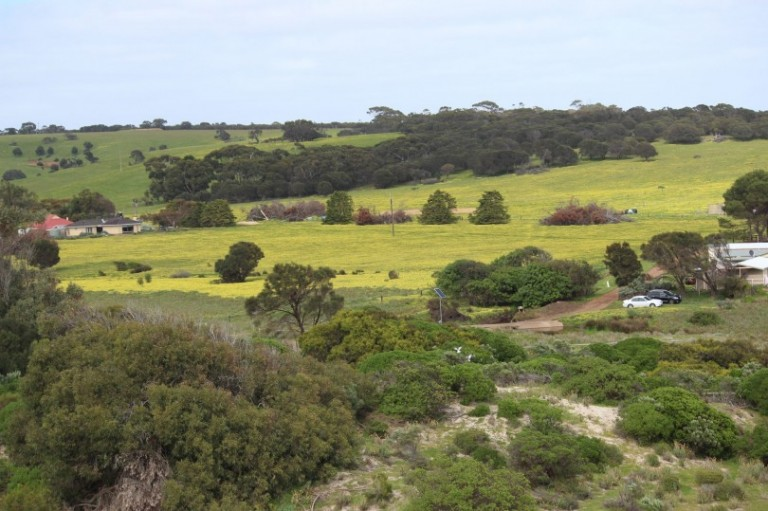
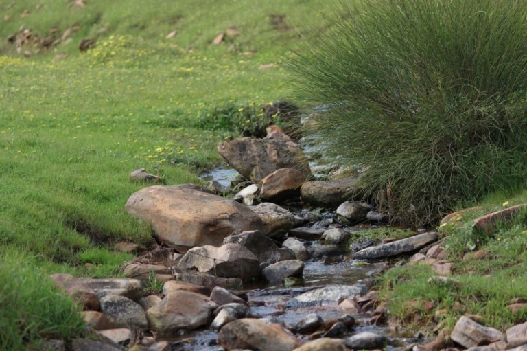

Als Nächstes: [Kangaroo Island - Känguru, Koala, Leuchtturm, Robben & Felsen](../day_14)
