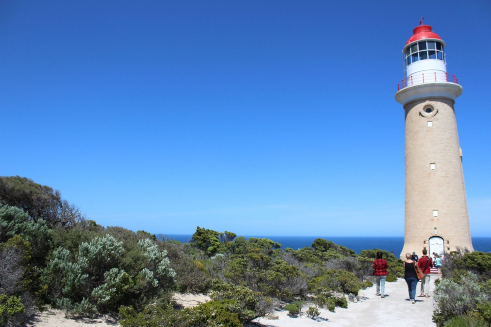
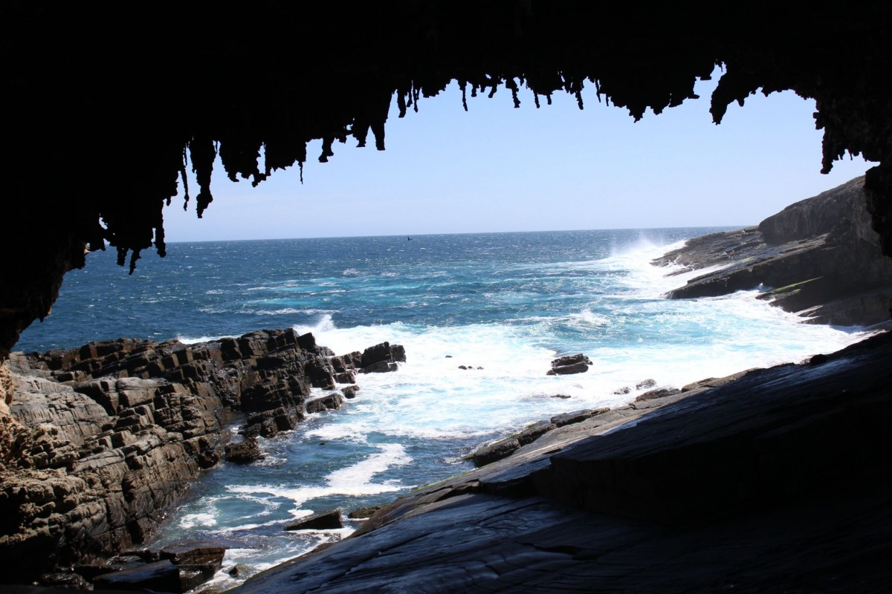
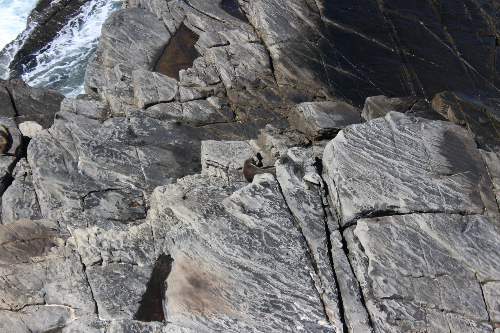
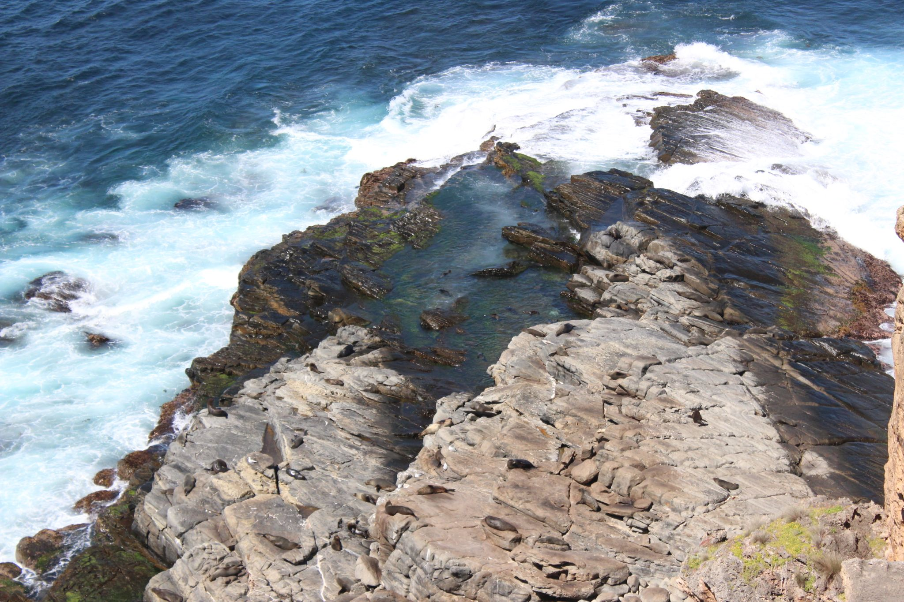
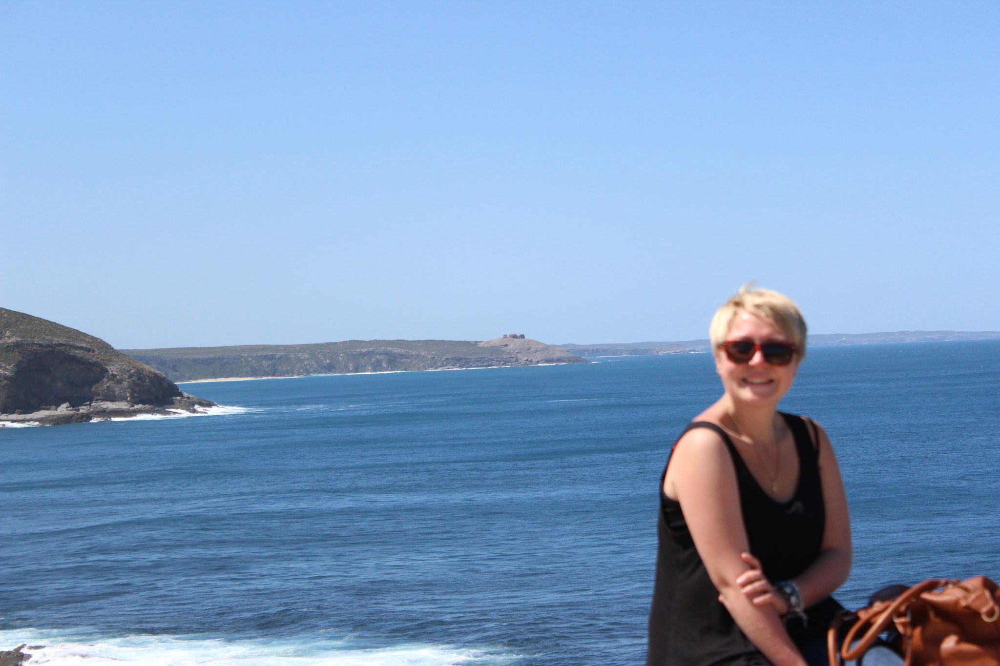
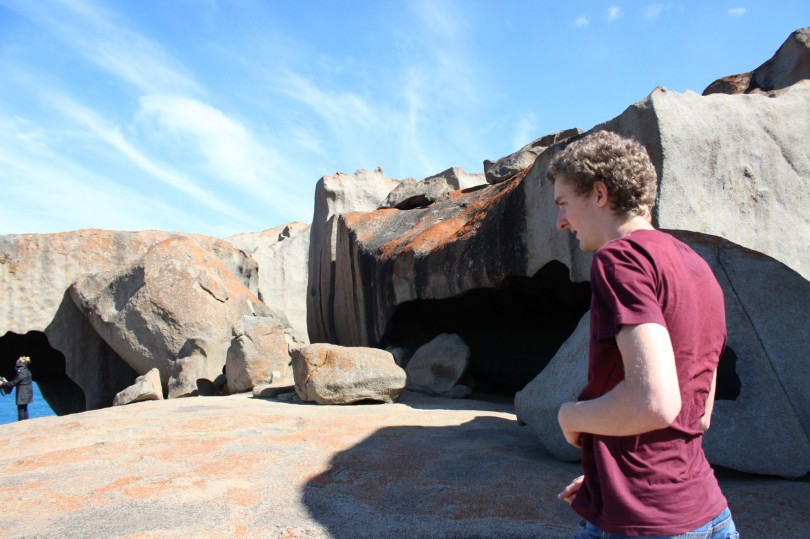
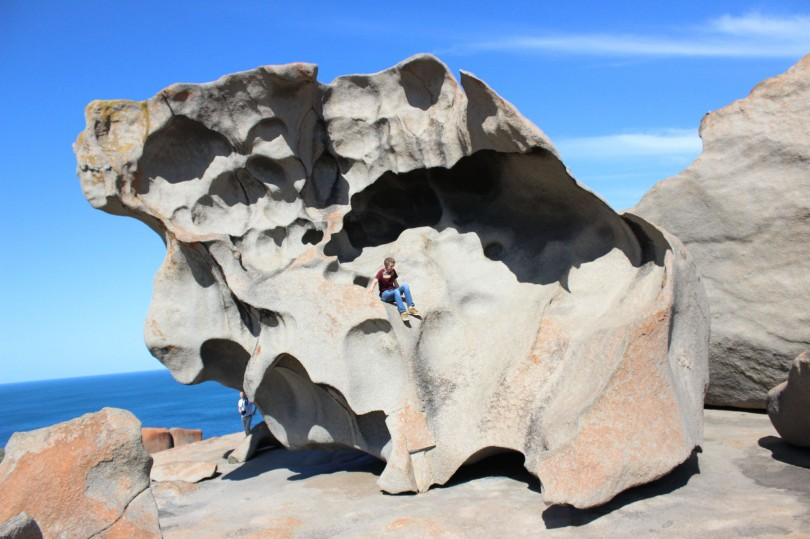
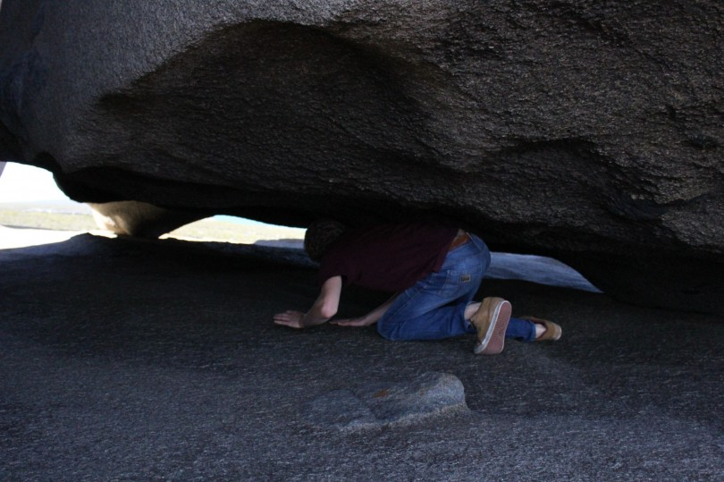
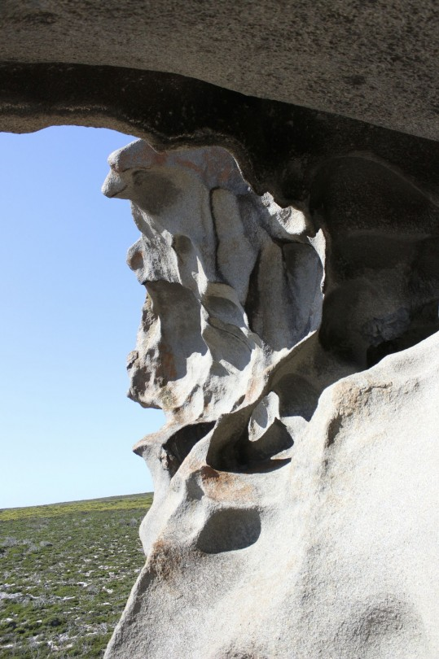

[Navigation](/posts/30-der-stuart-highway/)

Previous:  [Kangaroo Island – Waking up in paradise](../day_13)

Today was sightseeing again. We went to see the famous landmarks of Kangaroo
Island: The lighthouse, the seals, the remarkable rocks and we found a koala.

A path led from the light house down to the sea and opened the view to a
wonderful arch that was caved by waves into the rock.

However, that was not the only thing to see down there: Seals were sleeping on
the rocks in the sun, and a collection of rocks was visible in the distance.

Those rocks were our next destination. They are some remnants of the past. A
harder rock than the surrounding that was carved by wind, sand and weather.

We finished the day on a camp ground with amenities so we could shower and cook
properly. It was really nice and we enjoyed the last night on the road. We
managed to almost lure a wallaby to chill with us and we went for a walk
through the bush.

One thing was for sure: we now knew why it was called Kangaroo Island.

Next: [Adelaide – Time to relax](../day_15)
